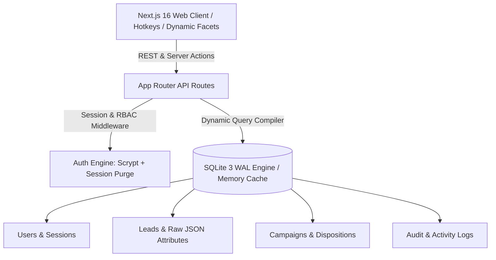

# 🎓 DreamDesk CRM

> **Next-Generation, High-Density Admissions & Higher-Education CRM**  
> Engineered for 500,000+ student records with sub-30ms query latency, zero external database bloat, dynamic schema discovery, and strict role-based access control.

---

## ⚡ Tech Stack & Architecture

- **Framework**: [Next.js 16 (App Router + Turbopack)](https://nextjs.org) with React 19
- **Database Engine**: Embedded **SQLite with WAL Mode** (`better-sqlite3`), 64MB memory cache tuning, and normalized indexed JSON metadata
- **Styling**: Tailwind CSS v4 + Radix UI / Base UI primitives
- **Analytics & Data Viz**: Recharts 3 + Lucide Icons + CmdK Command Center
- **Security & RBAC**: Scrypt password hashing with cryptographically random salts, instant session revocation, IP & Geolocation tracking



---

## 🔐 Role-Based Access Control (RBAC) & Demo Logins

DreamDesk CRM enforces strict data boundaries: counselors only see student leads assigned directly to them, while Team Leads and Admins maintain full institutional oversight.

### Default Staff Accounts

All accounts are pre-seeded with the password: **`password123`**

| Role | Name | Email | Password | Permissions & Workspace Scope |
|---|---|---|---|---|
| **Super Admin** | Super Admin | `admin@dreamdesk.in` | `password123` | Full System Access: User Management, Instant Deactivation, Schema Studio, Campaigns, Bulk Lead Dock |
| **Team Lead** | Vikram Malhotra | `vikram.m@dreamdesk.in` | `password123` | All Leads, Performance Dashboard, Auto-Balance Lead Allocation |
| **Senior Counselor** | Rohit Sharma | `rohit.sharma@dreamdesk.in` | `password123` | Private Assigned Leads, Callback Queues, Advanced Dispositions |
| **Counselor** | Ananya Verma | `ananya.v@dreamdesk.in` | `password123` | Private Assigned Leads, WhatsApp Drawer, Direct Dialing |
| **Counselor** | Priya Patel | `priya.p@dreamdesk.in` | `password123` | Private Assigned Leads, WhatsApp Drawer, Direct Dialing |
| **Counselor** | Sneha Rao | `sneha.rao@dreamdesk.in` | `password123` | Private Assigned Leads, WhatsApp Drawer, Direct Dialing |
| **Telecaller** | Aditya Roy | `aditya.roy@dreamdesk.in` | `password123` | Assigned Telecalling Queue, Fast Call Dispositions, Callbacks |

---

## ✨ Key Enterprise Features

### 1. 🚀 Zero-Latency Embedded Database (500k+ Leads)
Unlike traditional CRMs requiring separate Postgres, Redis, and Elasticsearch clusters that desynchronize, DreamDesk CRM runs directly on an optimized SQLite WAL (Write-Ahead Logging) storage engine:
- Sub-30ms facet compilation across 500,000 records.
- In-memory temporary stores and high-density indexing on phones, statuses, and counselors.

### 2. 🧩 Dynamic Schema Studio
- Create, rename, hide, and reorder custom lead columns on the fly without database migrations.
- Custom attributes (e.g. *JEE Percentile*, *Preferred Stream*, *Hostel Required*, *Parent Phone*) are stored as queryable JSON documents with automatic faceted filter discovery.

### 3. ⚖️ Intelligent Lead Distribution & Bulk Dock
- **Round-Robin Auto-Balancing**: Evenly split hundreds of unassigned leads among active counselors in 1-click.
- **Custom Quota Allocation**: Assign specific lead volumes to team members based on capacity.
- **Sequential Stepper**: Use <kbd>&uarr;</kbd> / <kbd>&darr;</kbd> or <kbd>j</kbd> / <kbd>k</kbd> to step through student profiles without opening and closing drawers.

### 4. 📞 Customizable Dispositions & 2-Level Sub-Dispositions
- Standardized call outcomes: *Admission Form Submitted*, *Counseling Session Booked*, *Interested - High Intent*, *Callback Requested*, *Ringing No Response*, *Not Interested*.
- Nested sub-dispositions (*Fee Paid*, *Provisional Letter Issued*, *Campus Visit Scheduled*, *Awaiting Board Results*).
- Multi-channel linking: Associate specific disposition sets to specific marketing campaigns.

### 5. 💬 1-Click WhatsApp & Phone Integration
- Integrated WhatsApp message drawer with dynamic variable interpolation (`{name}`, `{stream}`, `{lead_code}`, `{callback_at}`).
- Pre-built templates for Admission Brochures, Counseling Confirmations, Scholarship Tests, and Follow-ups.
- Direct `tel:` links for desktop softphones and mobile click-to-call.

### 6. 🛑 Instant User Deactivation & Real-Time Lockout
- Admins can instantly deactivate compromised or departing counselors from the Team Management tab.
- Instantly flushes all active SQLite sessions for that user.
- Periodic client heartbeat detects the 401 status and redirects the deactivated user to the login screen immediately.

### 7. 🌍 Login Geolocation & IP Audit Logging
- Automatically logs user IP address, approximate city, country, and ISP on every login.
- Displays last login metadata in the Staff Management table and writes tamper-evident audit records in `activity_logs`.

### 8. 📊 Executive Dashboard with Multi-Dimensional Filtering
- Filter entire analytics datasets by:
  - **Date Presets**: Today, Yesterday, Last 7 Days, Last 30 Days, This Quarter, This Year, or Custom Date Range.
  - **Counselor Workloads**: Compare throughput across staff.
  - **Marketing Campaigns**: Track conversion rates per channel.
  - **Stream & Academic Boards**: Visualize demographic breakdowns.
- **1-Click CSV Export**: Download filtered lead reports directly from the dashboard.

---

## ⌨️ Productivity Hotkeys

| Hotkey | Action |
|---|---|
| <kbd>Ctrl</kbd> + <kbd>K</kbd> / <kbd>⌘</kbd> + <kbd>K</kbd> | Open Global Command Center |
| <kbd>j</kbd> / <kbd>k</kbd> or <kbd>&darr;</kbd> / <kbd>&uarr;</kbd> | Navigate to next / previous student lead |
| <kbd>x</kbd> | Toggle checkbox selection on active row |
| <kbd>c</kbd> | Quick call active student lead |
| <kbd>w</kbd> | Open WhatsApp drawer for active student |
| <kbd>/</kbd> | Focus search bar |
| <kbd>Esc</kbd> | Close drawer or modal dialog |

---

## 🛠️ Getting Started

### 1. Prerequisites
- **Node.js**: `18.18+` or `20.x` or `24.x`
- **npm** / **yarn** / **pnpm**

### 2. Clone and Install
```bash
git clone https://github.com/rdsdd2021/DreamDesk-CRM.git
cd "DreamDesk CRM"
npm install
```

### 3. Populate Seed Data
DreamDesk CRM includes a self-contained seeder script that provisions all staff accounts, campaigns, disposition codes, routing rules, WhatsApp templates, and realistic student leads:

```bash
# Safe seed (preserves existing data or creates initial records)
npm run seed

# Full reset & rebuild (drops and re-populates clean database)
npm run seed:reset
```

### 4. Run Development Server
```bash
npm run dev
```
Open [http://localhost:3000](http://localhost:3000) in your browser.

---

## 🐳 Production Deployment

### Option A: Docker & Docker Compose (Recommended)

DreamDesk CRM is fully containerized with a lightweight multi-stage Docker build and persistent storage volume:

```bash
# 1. Copy production environment template
cp .env.example .env

# 2. Build and launch container in background
docker compose up -d --build

# 3. (Optional) Run seed script inside the running container
docker compose exec crm npm run seed
```

Access the CRM at `http://<your-server-ip>:3000`. Database files will persist safely in `./data` on your host machine.

### Option B: PM2 / Direct Node.js Deployment

```bash
# 1. Set environment variables
export NODE_ENV=production
export PORT=3000
export DATABASE_DIR=/var/data/dreamdesk
export DATABASE_PATH=/var/data/dreamdesk/crm.db

# 2. Build Next.js application
npm run build

# 3. Seed database
npm run seed

# 4. Start with PM2
pm2 start npm --name "dreamdesk-crm" -- start
```

---

## ⚙️ Environment Variables

| Variable | Default | Description |
|---|---|---|
| `NODE_ENV` | `development` | Set to `production` in production environments |
| `PORT` | `3000` | Port on which the HTTP server listens |
| `DATABASE_DIR` | `./data` | Directory where SQLite `.db` and WAL files are stored |
| `DATABASE_PATH` | `./data/crm.db` | Absolute or relative path to the SQLite database |
| `SESSION_EXPIRY_DAYS` | `7` | Duration in days before staff sessions expire |

---

## 📁 Project Directory Structure

```
DreamDesk CRM/
├── data/                    # Persistent SQLite WAL database (gitignored)
│   └── .gitkeep
├── public/                  # Static assets and icons
├── scripts/
│   └── seed.mjs             # Robust CLI database seeder
├── src/
│   ├── app/
│   │   ├── api/             # REST Endpoints: auth, leads, campaigns, dispositions, analytics
│   │   ├── login/           # Modern Glassmorphic Login Screen
│   │   └── page.tsx         # Core High-Density CRM Workspace
│   ├── components/
│   │   ├── crm/             # CRM Modules: LeadTable, Pipeline, Dashboard, Studio, Drawers
│   │   └── ui/              # Accessible primitives: Dialog, Dropdown, Button, Badges
│   └── lib/
│       ├── auth/            # Scrypt password hashing & session management
│       └── db/              # SQLite connection, WAL tuning & migrations
├── Dockerfile               # Production multi-stage Docker configuration
├── docker-compose.yml       # Production Compose specification with volume mapping
├── .env.example             # Documented production environment template
├── package.json
└── README.md
```

---

## 📄 License
Private & Proprietary — Built for DreamDesk Education Solutions.
