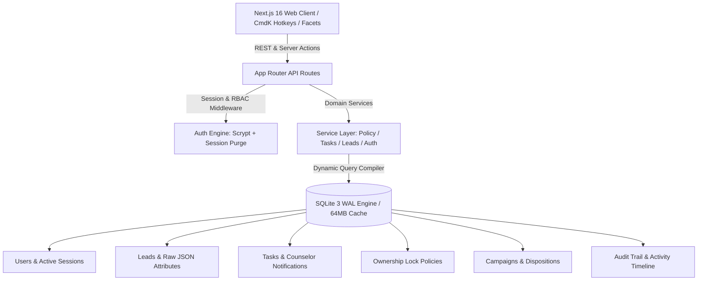

# 🎓 DreamDesk CRM

> **Next-Generation, High-Density Admissions & Higher-Education CRM**  
> Engineered for 500,000+ student records with sub-30ms query latency, zero external database bloat, dynamic schema discovery, counselor ownership protection, and strict role-based access control.

[-black?style=flat&logo=next.js)](https://nextjs.org)
[](https://react.dev)
[](https://sqlite.org)
[](https://tailwindcss.com)
[](#-license)

---

## ⚡ Tech Stack & Architecture

- **Framework**: [Next.js 16 (App Router + Turbopack)](https://nextjs.org) with React 19
- **Database Engine**: Embedded **SQLite with WAL Mode** (`better-sqlite3`), 64MB memory cache tuning, sub-30ms queries across 500k records, and normalized indexed JSON metadata
- **Services Architecture**: Decoupled domain service layer (`authService`, `leadsService`, `policyService`, `tasksService`)
- **Styling**: Tailwind CSS v4 + Radix UI / Base UI accessible primitives
- **Analytics & Data Viz**: Recharts 3 + Lucide Icons + CmdK Command Center
- **Security & RBAC**: Scrypt password hashing with cryptographically random salts, instant session revocation, IP & Geolocation tracking
- **Task & Notification Engine**: Priority-based task generator with dynamic SLAs (Urgent 4h, High 12h, Normal 24h, Low 48h) and real-time in-app notification center



---

## 🔐 Role-Based Access Control (RBAC) & Demo Logins

DreamDesk CRM enforces strict institutional data boundaries: counselors only access student leads assigned directly to them, while Team Leads and Admins maintain full institutional oversight.

### Default Staff Accounts

All accounts are pre-seeded with the password: **`password123`**

| Role | Name | Email | Password | Permissions & Workspace Scope |
|---|---|---|---|---|
| **Super Admin** | Super Admin | `admin@dreamdesk.in` | `password123` | Full System Access: User Management, Instant Deactivation, Schema Studio, Campaigns, Bulk Lead Dock, Policy Overrides |
| **Team Lead** | Vikram Malhotra | `vikram.m@dreamdesk.in` | `password123` | All Leads, Team Performance Dashboard, Auto-Balance Lead Allocation, Policy Overrides |
| **Senior Counselor** | Rohit Sharma | `rohit.sharma@dreamdesk.in` | `password123` | Private Assigned Leads, Priority Callbacks, Follow-up Queues, Advanced Dispositions |
| **Counselor** | Ananya Verma | `ananya.v@dreamdesk.in` | `password123` | Private Assigned Leads, WhatsApp Drawer, Direct Dialing, In-App Notifications |
| **Counselor** | Priya Patel | `priya.p@dreamdesk.in` | `password123` | Private Assigned Leads, WhatsApp Drawer, Direct Dialing, In-App Notifications |
| **Counselor** | Sneha Rao | `sneha.rao@dreamdesk.in` | `password123` | Private Assigned Leads, WhatsApp Drawer, Direct Dialing, In-App Notifications |
| **Telecaller** | Aditya Roy | `aditya.roy@dreamdesk.in` | `password123` | Assigned Telecalling Queue, Fast Call Dispositions, Callback Queue |

---

## ✨ Key Enterprise Features

### 1. 🚀 Zero-Latency Embedded Database (500k+ Leads)
Unlike traditional CRMs requiring separate Postgres, Redis, and Elasticsearch clusters that desynchronize, DreamDesk CRM runs directly on an optimized SQLite WAL (Write-Ahead Logging) storage engine:
- Sub-30ms facet compilation across 500,000+ student records.
- In-memory temporary stores and high-density indexing on phones, statuses, campaigns, and counselors.
- Zero external database installation or cloud maintenance required.

### 2. 🛡️ 7-Day Counselor Ownership Policy & Anti-Poaching Governance
Student-counselor relationships are critical for conversion. DreamDesk CRM prevents accidental lead poaching and conflicting consultations:
- **7-Day Call Lock**: Leads contacted via logged call, disposition, or consultation note within the past 7 days are automatically locked to that counselor.
- **Bulk Protection Guard**: During bulk reassignments or auto-distribution, locked leads are automatically segregated and skipped.
- **Admin & Team Lead Override**: Authorized managers can explicitly bypass the lock using an administrative reason logged directly to the audit trail.
- **Visual Protection Badges**: Real-time lock indicators on lead cards and drawers show counselor ownership and days remaining until unlock.

### 3. 🔔 Prioritized Bulk Task Engine & In-App Notification Center
Administrative actions directly trigger actionable caller workflows:
- **Automatic Task Generation**: Bulk operations (Assignment, Campaign Re-attribution, Tagging) can instantly spawn prioritized follow-up tasks for counselors.
- **Dynamic SLA Timers**: Tasks feature built-in SLA deadlines:
  - 🔴 **Urgent**: 4 hours
  - 🟠 **High**: 12 hours
  - 🔵 **Normal**: 24 hours
  - ⚪ **Low**: 48 hours
- **Top Navigation Notification Bell**: Real-time unread badge counter, priority pills, and 1-click navigation to caller tasks.
- **Unified Tasks & Callback Command Center**: Consolidated view of follow-ups and scheduled callbacks with 1-click completion and optimistic UI updates.

### 4. 📜 Smart Executive Journey & Multi-Density Lead Timeline
Replaces bloated, 3,000px vertical activity feeds with an intelligent, high-density briefing:
- **Executive Journey Highlights Strip**: 4-card at-a-glance briefing displaying *Intake & Pipeline Age*, *Call Engagement & Last Contact*, *Counselor Ownership*, and *Current Admissions Stage*.
- **Pinned Latest Remark Banner**: Instantly highlights the most recent consultation remark at the top of the timeline.
- **Dual Density Modes**:
  - **`Compact` (Default)**: 75% vertical space reduction with single-line rows, colored action chips, truncated remarks, and expandable old/new state transitions.
  - **`Detailed`**: Full card view for deep institutional audit inspection.
- **Smart Date Bucketing**: Automatically organizes historical events into *Today*, *Yesterday*, *Day of Week*, and *Earlier History*.
- **Signal Filtering & Search**: Instant filter pills (`All`, `📞 Calls & Notes`, `🔄 Stages`, `⚙️ System`) and real-time in-timeline search bar.
- **Quick Note Composer**: 1-click preset chips for instant consultation logging (e.g. `+ Parent requested follow-up`, `+ Fee structure shared`).

### 5. 🎯 Bulk Operations Engine (Campaign Switcher, Tag Studio & Reassignment)
- **Bulk Campaign Switcher (`BulkCampaignModal`)**: Move selected cohorts between campaigns with optional priority follow-up tasks and caller notifications.
- **Bulk Tag Studio (`BulkTagsModal`)**: Add or remove tags across hundreds of student records simultaneously.
- **Bulk Reassignment (`BulkAssignModal`)**: Reallocate cohorts to specific counselors with policy check validation and task creation.
- **Bulk Lifecycle Stage Updater**: Transition student admissions stages in mass.
- **Duplicate Detection & Merging**: Merge duplicate student inquiries while consolidating contact history.

### 6. ⚖️ Intelligent Lead Distribution & Auto-Balancing
- **Round-Robin Auto-Balancing**: Evenly split hundreds of unassigned leads among active counselors in 1 click.
- **Custom Quota Allocation**: Assign specific lead volumes to team members based on capacity and shift schedules.
- **Sequential Stepper**: Use <kbd>&uarr;</kbd> / <kbd>&darr;</kbd> or <kbd>j</kbd> / <kbd>k</kbd> to step through student profiles without opening and closing drawers.

### 7. 🧩 Dynamic Schema Studio
- Create, rename, hide, and reorder custom student attributes on the fly without database migrations.
- Dynamic attributes (e.g. *JEE Percentile*, *Preferred Stream*, *Hostel Required*, *Parent Phone*) are stored as queryable JSON documents with automatic faceted filter discovery.

### 8. 📞 Telecalling Retry Cadence, 2-Zone Controller & Supervisory Stage Locking
- **"Unreachable is an Attempt, Not Contact Proof"**: Ringing No Answer, Busy, Switched Off, and Invalid Number increment `attempt_count` and enforce an automated cooling-off window (3h cooldown) without falsely marking the student as *Contacted*.
- **Configurable Retry Limits**: Unreachable leads remain active in retry queues until max attempts (default: 3) are exhausted, after which they automatically transition to the *Unreachable* pool for SMS/WhatsApp drip re-engagement.
- **2-Zone Outcome Controller**:
  - *Zone 1 (1-Click Instant Retry)*: 0.2s 1-click outcome chips (`RNR`, `Busy`, `Switched Off`, `Wrong Number`) with optional queue auto-advance on the Speed Dialer Desk and Student Profile Drawer.
  - *Zone 2 (Connected Conversation)*: Categorized chips with progressive sub-dispositions, counseling booking confirmation prompts, and mandatory callback presets (`+2h`, `Tomorrow 11 AM`, `Tomorrow 4 PM`, `Next Monday`).
- **Supervisory Lifecycle Stage Locking**: Counselors cannot manually toggle admission stages; stages are calculated automatically by CRM rules based on validated call outcomes. Manual stage overrides are locked and restricted to Supervisors (`Admin` / `Team Lead`) with full audit trail logging.
- **Dynamic Objection Rebuttal Assistant**: In-drawer talking points tailored to specific student hesitations (budget/fee installment plans, NAAC A+ placements, hostel safety, scholarship tests).

### 9. 💬 1-Click WhatsApp & Phone Softphone Integration
- Integrated WhatsApp message drawer with dynamic variable interpolation (`{name}`, `{stream}`, `{lead_code}`, `{callback_at}`).
- Pre-built templates for Admission Brochures, Counseling Confirmations, Scholarship Tests, and Follow-ups.
- Direct `tel:` links for desktop softphones and mobile click-to-call.

### 10. 🛑 Instant User Deactivation & Real-Time Session Lockout
- Admins can instantly deactivate compromised or departing counselors from the Team Management tab.
- Instantly flushes all active SQLite sessions for that user.
- Periodic client heartbeat detects the 401 status and redirects the deactivated user to the login screen immediately.

### 11. 🌍 Login Geolocation & IP Audit Logging
- Automatically logs user IP address, approximate city, country, and ISP on every login.
- Displays last login metadata in the Staff Management table and writes tamper-evident audit records in `activity_logs`.

### 12. 📊 Executive Dashboard with Multi-Dimensional Filtering
- Filter entire analytics datasets by:
  - **Date Presets**: Today, Yesterday, Last 7 Days, Last 30 Days, This Quarter, This Year, or Custom Date Range.
  - **Counselor Workloads**: Compare throughput across staff.
  - **Marketing Campaigns**: Track conversion rates per channel.
  - **Stream & Academic Boards**: Visualize demographic breakdowns.
- **1-Click CSV Export**: Download filtered lead reports directly from the dashboard.

---

## 🌐 Complete REST API Reference

The CRM exposes 30+ optimized App Router REST endpoints with strict session authentication and RBAC validation:

| Category | Method | Endpoint | Description | Access |
|---|---|---|---|---|
| **Auth** | `POST` | `/api/auth/login` | Staff authentication with Scrypt & session cookie | Public |
| | `POST` | `/api/auth/logout` | Session invalidation and cookie purge | Authenticated |
| | `GET` | `/api/auth/me` | Current user profile, role, and workspace scope | Authenticated |
| **Leads** | `GET` | `/api/leads` | Paginated lead queries with faceted filters | Role-scoped |
| | `POST` | `/api/leads` | Create single student lead record | Authenticated |
| | `POST` | `/api/leads/import` | CSV/Excel batch lead ingestion | Admin / TL |
| | `POST` | `/api/leads/generate` | Mock lead generation for testing | Super Admin |
| | `POST` | `/api/leads/claim` | Self-claim unassigned lead from public queue | Counselor |
| | `POST` | `/api/leads/duplicates` | Merge duplicate records and consolidate history | Admin / TL |
| | `GET` | `/api/leads/[id]/activities` | Retrieve lead activity history & timeline | Role-scoped |
| | `POST` | `/api/leads/[id]/disposition` | Log call disposition, notes & scheduled callbacks | Role-scoped |
| | `PATCH` | `/api/leads/[id]/field` | Update single custom schema field | Role-scoped |
| | `PATCH` | `/api/leads/[id]/tags` | Add or remove tags on a single lead | Role-scoped |
| **Bulk Engine** | `POST` | `/api/leads/bulk-assign` | Bulk reallocate with 7-day policy check & task engine | Admin / TL |
| | `POST` | `/api/leads/auto-distribute` | Round-robin auto-distribution among active counselors | Admin / TL |
| | `POST` | `/api/leads/bulk-campaign` | Re-attribute leads to campaign with optional tasks | Admin / TL |
| | `POST` | `/api/leads/bulk-tags` | Batch tag insertion/removal across selected leads | Admin / TL |
| | `POST` | `/api/leads/bulk-status` | Batch admissions lifecycle stage transition | Admin / TL |
| | `POST` | `/api/leads/bulk-delete` | Permanent soft/hard purge of selected leads | Super Admin |
| **Tasks & Alerts** | `GET` | `/api/tasks` | Fetch counselor tasks and scheduled callbacks | Authenticated |
| | `POST` | `/api/tasks` | Create manual or callback task | Authenticated |
| | `PATCH` | `/api/tasks/[id]` | Mark task complete or update status | Assigned / Admin |
| | `GET` | `/api/notifications` | Fetch unread in-app alerts and notifications | Authenticated |
| | `PATCH` | `/api/notifications` | Mark single notification or all alerts as read | Authenticated |
| **Governance** | `GET` | `/api/policies` | Retrieve active ownership and assignment policies | Authenticated |
| | `POST` | `/api/policies/check` | Pre-flight validation of 7-day ownership lock | Authenticated |
| **Schema & Meta** | `GET` / `POST` | `/api/schema` | Custom field definition studio (JSON metadata) | Super Admin |
| | `GET` / `POST` | `/api/campaigns` | Marketing campaign creation and tracking | Admin / TL |
| | `GET` / `POST` | `/api/dispositions` | Root disposition code configuration | Admin / TL |
| | `GET` / `POST` | `/api/dispositions/sub` | Nested 2-level sub-disposition management | Admin / TL |
| | `GET` / `POST` | `/api/whatsapp-templates` | Manage WhatsApp message templates & variables | Admin / TL |
| | `GET` / `POST` | `/api/saved-views` | Custom counselor filter views and column sets | Authenticated |
| **Analytics & Audit**| `GET` | `/api/analytics/report` | Multi-dimensional dashboard analytics | Admin / TL |
| | `GET` | `/api/analytics/performance`| Counselor workload & throughput metrics | Admin / TL |
| | `GET` | `/api/activity` | System-wide administrative audit trail | Super Admin |
| | `GET` / `POST` | `/api/users` | Staff user management and instant deactivation | Super Admin |

---

## ⌨️ Productivity Hotkeys

| Hotkey | Action |
|---|---|
| <kbd>Ctrl</kbd> + <kbd>K</kbd> / <kbd>⌘</kbd> + <kbd>K</kbd> | Open Global Command Center |
| <kbd>j</kbd> / <kbd>k</kbd> or <kbd>&darr;</kbd> / <kbd>&uarr;</kbd> | Navigate to next / previous student lead |
| <kbd>x</kbd> | Toggle checkbox selection on active row |
| <kbd>c</kbd> | Quick call active student lead |
| <kbd>w</kbd> | Open WhatsApp drawer for active student |
| <kbd>/</kbd> | Focus global search bar |
| <kbd>Esc</kbd> | Close drawer or modal dialog |

---

## 🛠️ Getting Started

### 1. Prerequisites
- **Node.js**: `18.18+` or `20.x` or `24.x`
- **npm** / **yarn** / **pnpm**

### 2. Clone and Install
```bash
git clone https://github.com/rdsdd2021/DreamDesk-CRM.git
cd "DreamDesk CRM"
npm install
```

### 3. Populate Seed Data
DreamDesk CRM includes a self-contained seeder script that provisions all staff accounts, campaigns, disposition codes, routing rules, WhatsApp templates, and realistic student leads:

```bash
# Safe seed (preserves existing data or creates initial records)
npm run seed

# Full reset & rebuild (drops and re-populates clean database)
npm run seed:reset
```

### 4. Run Development Server
```bash
npm run dev
```
Open [http://localhost:3000](http://localhost:3000) in your browser.

---

## 🐳 Production Deployment

### Option A: Docker & Docker Compose (Recommended)

DreamDesk CRM is fully containerized with a lightweight multi-stage Docker build and persistent storage volume:

```bash
# 1. Copy production environment template
cp .env.example .env

# 2. Build and launch container in background
docker compose up -d --build

# 3. (Optional) Run seed script inside the running container
docker compose exec crm npm run seed
```

Access the CRM at `http://<your-server-ip>:3000`. Database files will persist safely in `./data` on your host machine.

### Option B: PM2 / Direct Node.js Deployment

```bash
# 1. Set environment variables
export NODE_ENV=production
export PORT=3000
export DATABASE_DIR=/var/data/dreamdesk
export DATABASE_PATH=/var/data/dreamdesk/crm.db

# 2. Build Next.js application
npm run build

# 3. Seed database
npm run seed

# 4. Start with PM2
pm2 start npm --name "dreamdesk-crm" -- start
```

---

## ⚙️ Environment Variables

| Variable | Default | Description |
|---|---|---|
| `NODE_ENV` | `development` | Set to `production` in production environments |
| `PORT` | `3000` | Port on which the HTTP server listens |
| `DATABASE_DIR` | `./data` | Directory where SQLite `.db` and WAL files are stored |
| `DATABASE_PATH` | `./data/crm.db` | Absolute or relative path to the SQLite database |
| `SESSION_EXPIRY_DAYS` | `7` | Duration in days before staff sessions expire |

---

## 📁 Project Directory Structure

```
DreamDesk CRM/
├── CHANGELOG.md                 # Granular release history and architectural log
├── Dockerfile                   # Multi-stage production container configuration
├── docker-compose.yml           # Production Compose specification with volume mapping
├── package.json
├── README.md
├── scripts/
│   └── seed.mjs                 # CLI seeder with realistic higher-ed cohorts
├── src/
│   ├── app/
│   │   ├── api/                 # 30+ App Router REST Endpoints
│   │   │   ├── activity/        # System-wide audit log endpoints
│   │   │   ├── analytics/       # Performance & institutional reporting
│   │   │   ├── auth/            # Scrypt login, logout & session validation
│   │   │   ├── campaigns/       # Campaign management
│   │   │   ├── dispositions/    # Dispositions & nested sub-dispositions
│   │   │   ├── leads/           # Leads, bulk actions, import & deduplication
│   │   │   ├── notifications/   # Counselor in-app notification center
│   │   │   ├── policies/        # 7-day counselor ownership protection
│   │   │   ├── schema/          # Dynamic Schema Studio definitions
│   │   │   ├── tasks/           # Priority follow-up & callback task engine
│   │   │   └── users/           # Staff accounts & instant deactivation
│   │   ├── login/               # Glassmorphic Login Screen
│   │   └── page.tsx             # High-Density Admissions Workspace
│   ├── components/
│   │   ├── crm/                 # Core CRM Modules
│   │   │   ├── BulkActionBar.tsx        # Floating multi-select operations dock
│   │   │   ├── BulkAssignModal.tsx      # Policy-aware lead reallocation modal
│   │   │   ├── BulkCampaignModal.tsx    # Campaign switcher with priority tasks
│   │   │   ├── BulkTagsModal.tsx        # Multi-tag batch editor
│   │   │   ├── EnhancedLeadDrawer.tsx   # Student deep-dive profile drawer
│   │   │   ├── LeadsTable.tsx           # High-density keyboard-navigable table
│   │   │   ├── LeadTimeline.tsx         # Executive Journey & Multi-Density log
│   │   │   ├── NotificationBell.tsx     # Real-time alert bell & task counter
│   │   │   ├── PipelineKanbanView.tsx   # Admissions pipeline board
│   │   │   ├── PoliciesWorkspace.tsx    # Governance & 7-day lock manager
│   │   │   ├── TasksWorkspace.tsx       # Priority tasks & callback center
│   │   │   └── ...
│   │   └── ui/                  # Radix UI / Base UI accessible primitives
│   └── lib/
│       ├── auth/                # Session encryption & scrypt authentication
│       ├── db/                  # SQLite WAL connection, migrations & indexes
│       └── services/            # Decoupled domain service layer
│           ├── authService.ts   # User & session security operations
│           ├── leadsService.ts  # Lead querying, filtering & mutations
│           ├── policyService.ts # 7-day call lock & ownership governance
│           └── tasksService.ts  # Prioritized task creation & notifications
```

---

## 📋 Detailed Changelog & Release Notes

For an in-depth, granular log of all schema additions, API expansions, and UI redesigns across every release, refer to:
👉 **[CHANGELOG.md](./CHANGELOG.md)**

### Release Highlights
- **v2.4.0 (2026-10-08)**: Redesigned Lead History into Smart Executive Journey & Multi-Density Timeline (`LeadTimeline.tsx`).
- **v2.3.0 (2026-10-07)**: Bulk Action Task Engine & Priority Notification System (`tasksService.ts`, `NotificationBell.tsx`, `BulkCampaignModal.tsx`).
- **v2.2.0 (2026-10-06)**: 7-Day Counselor Ownership Policy Protection & Anti-Poaching Governance (`policyService.ts`, `PoliciesWorkspace.tsx`).
- **v2.1.0 (2026-10-05)**: Comprehensive Audit Trail & Activity Logging Engine across all endpoints.
- **v2.0.0 (2026-10-01)**: Next.js 16 + Embedded SQLite WAL Platform Foundation with 500k+ lead capability.

---

## 📄 License
Private & Proprietary — Built for DreamDesk Education Solutions.
