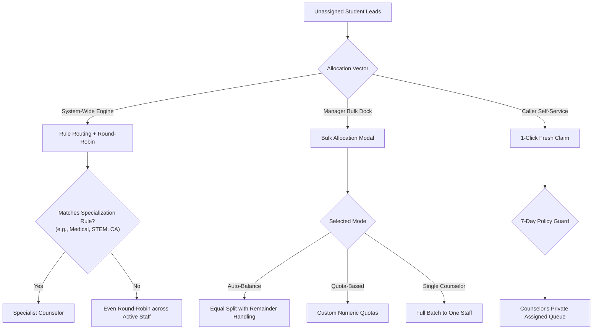

# 🎯 Lead Allocation & Distribution Engine Guide

This guide covers the three lead allocation mechanisms available in DreamDesk CRM: **System-Wide Auto-Distribution (Rule-Based + Round-Robin)**, **Interactive Bulk Auto-Balancing**, and **Counselor 1-Click Self-Claim**.

---

## 1. Feature Overview

Higher-education admissions teams receive thousands of inquiries daily from education fairs, online ads, and school outreach campaigns. DreamDesk CRM provides three specialized distribution pathways:



---

## 2. Allocation Vector 1: System-Wide Auto-Distribution Engine

*Technical Implementation*: [`LeadsService.autoDistributeLeads`](file:///C:/Users/Ramanuj%20Dey%20Sarkar/Desktop/New%20folder%20%282%29/DreamDesk%20CRM/src/lib/services/leadsService.ts#L2688) | API: `POST /api/leads/auto-distribute`

### How It Works:
The engine processes up to 250 (or user-defined) unassigned leads in a 2-phase process:

1. **Phase 1: Specialized Routing Rules (`assignment_rules` table)**:
   - Queries all active rules sorted by priority:
     ```sql
     SELECT * FROM assignment_rules WHERE is_active = 1 ORDER BY priority ASC
     ```
   - Matches candidate leads by inspecting their custom dynamic attributes in `raw_attributes` (e.g. `stream`, `city`, `board`, `exam_type`).
   - If a student matches a rule, they are directly routed to the designated specialist counselor.
2. **Phase 2: Fair Round-Robin Fallback**:
   - Leads that do not match any specialized rule fall into a fair round-robin loop among all counselors with `status = 'active'`:
     ```typescript
     assignedToUserId = activeCounselors[roundRobinIndex % activeCounselors.length].id;
     roundRobinIndex++;
     ```
3. **Atomic Transaction & Lineage**:
   - The entire batch executes inside a `db.transaction(...)`.
   - Every lead receives a detailed `lead_activities` entry: `Auto-Assigned to: Counselor Name (Allocated via automated distribution engine)`.
   - A system-wide audit entry is recorded in `activity_logs`.

---

## 3. Allocation Vector 2: Interactive Bulk Auto-Balancing

*Component*: [`BulkAssignModal.tsx`](file:///C:/Users/Ramanuj%20Dey%20Sarkar/Desktop/New%20folder%20%282%29/DreamDesk%20CRM/src/components/crm/BulkAssignModal.tsx) | Triggered from: [`BulkActionBar.tsx`](file:///C:/Users/Ramanuj%20Dey%20Sarkar/Desktop/New%20folder%20%282%29/DreamDesk%20CRM/src/components/crm/BulkActionBar.tsx)

When an Administrator or Team Lead selects 50, 100, or "All 4,500 Filtered Leads" and clicks **Assign** in the floating dock, the Bulk Assign Modal opens with 3 modes:

### Mode A: Auto-Balance (Equal Round-Robin)
- **Concept**: Evenly divides the selected lead count among checked counselors.
- **Live Preview Strip**: Displays exact distribution metrics before applying:
  - *Example*: 100 leads among 3 counselors ➔ *"33 leads each + 1 remainder to Counselor 1"*.
- **Counselor Selector**: Easily check or uncheck individual counselors or click *Select All*.

### Mode B: Quota-Based Split
- **Concept**: Enables managers to specify exact lead quotas per counselor based on capacity, experience, or shift hours.
- **Dynamic Capacity Meter**: A live progress bar shows `X / Y Allocated (Z%)`.
- **Validation**: Prevents allocating more leads than are currently selected.

### Mode C: Single Counselor
- **Concept**: Direct allocation of the entire cohort to one counselor (e.g., assigning all applicants from Bangalore to the South Regional Counselor).

### Connected Safeguards in Bulk Assign:
1. **🛡️ 7-Day Anti-Poaching Policy Protection**: Pre-checks each lead against [`PolicyService.validateBulkReassignment`](file:///C:/Users/Ramanuj%20Dey%20Sarkar/Desktop/New%20folder%20%282%29/DreamDesk%20CRM/src/lib/services/policyService.ts). Protected leads are automatically segregated and skipped unless overridden.
2. **🔔 Automated Prioritized Task Scheduling**: Optionally generates prioritized follow-up tasks (`urgent` 4h, `high` 12h, `normal` 24h, `low` 48h) and notifies each receiving counselor immediately.

---

## 4. Allocation Vector 3: Counselor 1-Click Self-Claim

*Technical Implementation*: [`LeadsService.claimUnassignedLeads`](file:///C:/Users/Ramanuj%20Dey%20Sarkar/Desktop/New%20folder%20%282%29/DreamDesk%20CRM/src/lib/services/leadsService.ts#L754) | API: `POST /api/leads/claim`

### How It Works:
For high-volume telecalling teams, counselors can claim fresh leads without manager intervention:
1. Counselor clicks **"Claim Fresh Leads (25)"** in the top navigation or work queue bar.
2. The system pulls unassigned leads in FIFO order (`ORDER BY id ASC`).
3. Candidate leads pass through the 7-day policy engine to guarantee no counselor claims a lead previously locked by another colleague.
4. Exactly 25 eligible leads are assigned directly to the counselor's private queue.

---

## 5. 🏫 Real-World Use Case Scenarios

### Scenario A: Higher-Education Admissions Expo (5,000 Inquiries)
- **Context**: The university collects 5,000 student forms at an education fair across Engineering, Medical, and Humanities streams.
- **Execution**:
  1. The Operations team imports the Excel sheet via the **Data Import** workspace.
  2. The Team Lead triggers **Auto-Distribute**:
     - 1,800 NEET applicants are routed to Dr. Priya Sharma (Medical specialist).
     - 2,100 JEE applicants are routed to Rohit Sharma (Engineering specialist).
     - The remaining 1,100 general applicants are evenly split across the 4 junior counselors via round-robin.
- **Outcome**: 100% of leads are matched by academic expertise in under 2 seconds.

### Scenario B: Monday Morning Quota Rebalance
- **Context**: Counselor A is on probation and can handle 30 calls/day. Counselor B is a senior counselor who can handle 80 calls/day. Counselor C is part-time (20 calls/day).
- **Execution**:
  1. Team Lead filters for `Status = 'New'` and selects all 130 leads.
  2. Opens **Bulk Assign Modal** and switches to **Quota-Based Split**.
  3. Enters: Senior Counselor: 80, Probationary Counselor: 30, Part-Time Counselor: 20.
  4. Checks *"Create Follow-up Task"* with **High Priority (12-hour SLA)**.
- **Outcome**: Each staff member receives their exact workload capacity with clear task deadlines in their in-app notification center.

### Scenario C: Fast Telecalling Queue Self-Pacing
- **Context**: 5 telecallers are conducting phone verifications. Fast callers finish their batches quickly and shouldn't wait for a supervisor to assign more.
- **Execution**:
  1. Telecaller completes their 25-call batch.
  2. Clicks **"Claim Fresh Leads (25)"**.
  3. System assigns the next 25 unassigned records in 15ms.
- **Outcome**: Eliminates supervisor bottlenecks and keeps telecallers active.

---

## 6. ⚙️ Database Schema & Configuration

### `assignment_rules` Table
```sql
CREATE TABLE assignment_rules (
  id TEXT PRIMARY KEY,
  name TEXT NOT NULL,
  criteria_field TEXT NOT NULL,    -- Attribute key (e.g. 'stream', 'city', 'board')
  criteria_value TEXT NOT NULL,    -- Matching value (e.g. 'Medical / NEET')
  assigned_to TEXT REFERENCES users(id) ON DELETE CASCADE,
  is_active INTEGER DEFAULT 1,
  priority INTEGER DEFAULT 1,     -- Evaluated in ascending priority order (1, 2, 3...)
  created_at DATETIME DEFAULT CURRENT_TIMESTAMP
);
```

### Pre-Seeded Default Rules:
| Priority | Rule Name | Criteria Field | Criteria Value | Designated Staff |
|---|---|---|---|---|
| **1** | Medical / NEET Specialist | `stream` | `Medical / NEET` | Dr. Priya Sharma |
| **2** | Engineering / JEE Specialist | `stream` | `Engineering / JEE` | Rohit Sharma |
| **3** | Commerce / CA Specialist | `stream` | `Commerce / CA` | Ananya Verma |
| **4** | Humanities / Arts Specialist | `stream` | `Humanities / Arts` | Vikram Malhotra |
