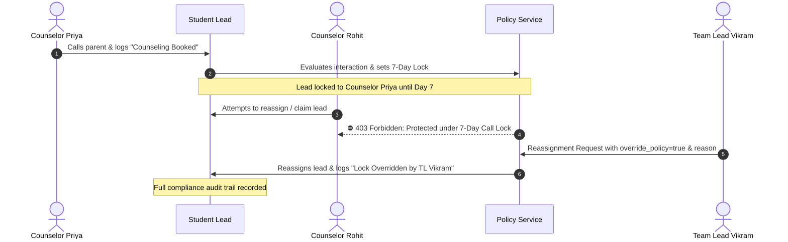

# 🛡️ 7-Day Counselor Ownership Policy & Anti-Poaching Governance

This guide covers the **7-Day Counselor Ownership Policy Protection System** in DreamDesk CRM, designed to eliminate lead poaching, preserve counselor-student rapport, and maintain institutional admissions governance.

---

## 1. Feature Overview & Problem Solved

### The Problem in Traditional CRMs:
In competitive admissions teams, student conversions often require multiple counseling sessions. In traditional CRMs:
- A counselor invests 40 minutes explaining fee structures and course syllabi to a parent.
- The next morning, another counselor or automated batch distribution reallocates that student, claiming the enrollment credit and commission.
- This creates internal conflict, duplicated phone calls to confused parents, and broken accountability.

### The DreamDesk CRM Solution:
DreamDesk CRM enforces an automated **7-Day Call & Interaction Lock**:
- Whenever an assigned counselor contacts a student (via phone call, logged disposition, consultation note, or WhatsApp message), the lead is **automatically locked** to that counselor for **7 days**.
- Other counselors, auto-distribution scripts, and self-claim tools are **strictly blocked** from reallocating the lead.
- Reassignment requires privileged authorization (Super Admin or Team Lead) with an explicit, audit-logged business justification.



---

## 2. Technical Mechanics & Verification

*Implementation*: [`PolicyService.ts`](file:///C:/Users/Ramanuj%20Dey%20Sarkar/Desktop/New%20folder%20%282%29/DreamDesk%20CRM/src/lib/services/policyService.ts) | Endpoint: `POST /api/policies/check`

### 1. Interaction Detection (`checkLeadLock`):
The policy engine inspects the lead's activity history:
```sql
SELECT created_at
FROM lead_activities
WHERE lead_id = ? 
  AND activity_type IN ('disposition', 'call', 'note', 'whatsapp')
  AND (performed_by_id = ? OR performed_by_id IS NULL)
ORDER BY created_at DESC
LIMIT 1
```
- **Protected Action Types**:
  - `call`: Direct phone calls.
  - `disposition`: Logged call outcomes (e.g. *Interested - High Intent*, *Campus Visit Scheduled*).
  - `note`: Consultation remarks logged via the Quick Note Composer in [`LeadTimeline.tsx`](file:///C:/Users/Ramanuj%20Dey%20Sarkar/Desktop/New%20folder%20%282%29/DreamDesk%20CRM/src/components/crm/LeadTimeline.tsx).
  - `whatsapp`: Dynamic WhatsApp messages sent from the communication drawer.
- **Caller Attribution Binding**: The lock is evaluated against interactions performed by the *currently assigned counselor* (`performed_by_id = lead.assigned_to`), preventing transfer recipients from inheriting unearned locks.

### 2. Time Delta Calculation:
```typescript
const diffMs = now.getTime() - lastInteractionDate.getTime();
const diffDays = diffMs / (1000 * 60 * 60 * 24);

if (diffDays < lockDays) {
  return {
    isLocked: true,
    counselorName: lead.counselor_name,
    daysRemaining: Math.ceil(lockDays - diffDays),
    lastCallAt: lastInteractionDate.toISOString(),
  };
}
```

---

## 3. Pre-Flight Batch Validation (`validateBulkReassignment`)

When an administrator attempts a bulk reallocation (e.g., reassigning 200 leads):
1. The system segregates the target leads into two distinct sets:
   - **`allowedIds`**: Leads with no calls within 7 days, or leads already assigned to the target user.
   - **`lockedIds`**: Leads actively protected under another counselor's 7-day interaction lock.
2. In the UI ([`BulkAssignModal.tsx`](file:///C:/Users/Ramanuj%20Dey%20Sarkar/Desktop/New%20folder%20%282%29/DreamDesk%20CRM/src/components/crm/BulkAssignModal.tsx)), the manager sees a live warning banner:
   - *“🛡️ 28 of 200 selected leads are protected under the 7-day call lock policy.”*
3. **Behavior Without Override**: The engine processes the 172 allowed leads and safely leaves the 28 protected leads untouched.
4. **Behavior With Privileged Override**: If an Admin or Team Lead checks *"Override Policy Locks"*, the system processes all 200 leads, writing a `Lock Overridden` activity entry on each affected student record.

---

## 4. UI Indicators & Visual Feedback

### A. Lead Table Protection Badge
In [`LeadsTable.tsx`](file:///C:/Users/Ramanuj%20Dey%20Sarkar/Desktop/New%20folder%20%282%29/DreamDesk%20CRM/src/components/crm/LeadsTable.tsx), leads protected under active locks display a subtle emerald lock badge beside the assigned counselor's name.

### B. Student Profile Drawer Lock Banner
In [`EnhancedLeadDrawer.tsx`](file:///C:/Users/Ramanuj%20Dey%20Sarkar/Desktop/New%20folder%20%282%29/DreamDesk%20CRM/src/components/crm/EnhancedLeadDrawer.tsx), opening a locked lead displays an executive status banner:
> 🛡️ **Counselor Ownership Active**  
> Locked to **Sneha Rao** • Last contacted **2 days ago** • Unlocks in **5 days**

### C. Dedicated Governance Studio (`PoliciesWorkspace.tsx`)
Administrators can navigate to the **Governance & Policies** tab to:
- Adjust lock duration (default: 7 days, configurable between 1 and 30 days).
- View total currently protected leads across the institution.
- Inspect the 30-day policy override log with manager names and timestamps.

---

## 5. 🏫 Real-World Use Case Scenarios

### Scenario A: Prevent Accidental Lead Poaching
- **Context**: Counselor Sneha Rao calls a high-scoring student on Tuesday, explaining scholarship criteria. On Wednesday, the student calls the main office. Telecaller Aditya picks up and wants to reassign the student to himself.
- **System Action**: Aditya attempts to reassign the lead. The system blocks the update:
  - *“Policy Restriction: This lead was contacted by Sneha Rao on Tuesday. Reassignment is locked for 6 more days.”*
- **Outcome**: Aditya connects the parent back to Sneha, preserving student rapport.

### Scenario B: Counselor Sudden Medical Leave (Administrative Override)
- **Context**: Counselor Rohit is suddenly hospitalized for 2 weeks. His 45 high-priority counseling leads must be transferred immediately to Senior Counselor Vikram.
- **System Action**:
  1. Team Lead Vikram filters for `Assigned to: Rohit` and selects all 45 leads.
  2. Opens **Bulk Assign Modal** and selects Vikram as target.
  3. The modal highlights: *"🛡️ 38 leads are protected under Rohit's 7-day call lock."*
  4. Team Lead toggles **Override Policy Locks** (authorized only for Admin / TL).
  5. The transfer completes atomically. Each student's timeline records:
     `Assigned to Counselor: Vikram (Admin/Team Leader override of 7-day lock)`.
- **Outcome**: Critical student inquiries are not abandoned during staff emergencies while maintaining compliance transparency.

### Scenario C: Unassigned Inflow Self-Claim Protection
- **Context**: An unassigned lead was contacted 3 days ago by Counselor Priya before being inadvertently unassigned. Junior Counselor Aditya attempts to click **"Claim Fresh Leads (25)"**.
- **System Action**: `claimUnassignedLeads` evaluates Priya's recent interaction and automatically skips this lead, ensuring Aditya only claims truly fresh inquiries.

---

## 6. 🔐 Permissions & Access Control

| Action | Super Admin | Team Lead | Counselor | Telecaller |
|---|---|---|---|---|
| Trigger 7-Day Lock via Call/Note/WhatsApp | ✅ Yes | ✅ Yes | ✅ Yes | ✅ Yes |
| View Lock Status on Profile Drawer | ✅ Yes | ✅ Yes | ✅ Yes | ✅ Yes |
| Reassign Unlocked Leads | ✅ Yes | ✅ Yes | ❌ Blocked | ❌ Blocked |
| **Override Active 7-Day Lock** | ✅ **Authorized** | ✅ **Authorized** | ⛔ **Denied (403)** | ⛔ **Denied (403)** |
| Modify Policy Duration (Days) | ✅ Yes | ❌ Blocked | ❌ Blocked | ❌ Blocked |
