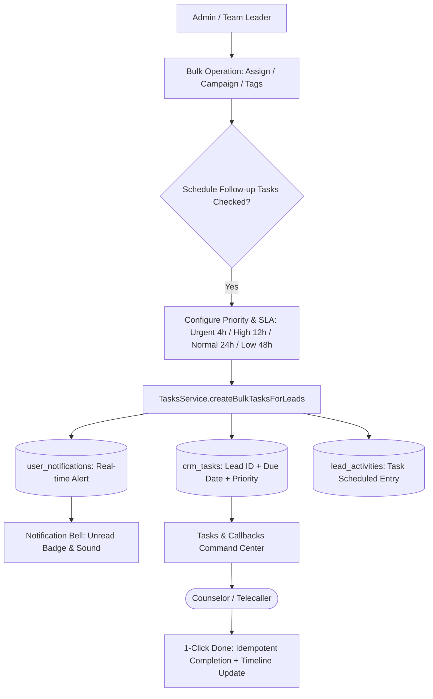

# 🔔 Prioritized Bulk Task Engine & Notification Center Guide

This guide covers the **Actionable Bulk Task Engine** and **In-App Notification Center** in DreamDesk CRM, designed to bridge administrative batch operations directly to counselor call workflows with dynamic Service Level Agreements (SLAs).

---

## 1. Feature Overview & Architecture

When admissions leaders take bulk actions (reassigning cohorts, launching marketing campaigns, or tagging high-scoring students), telecallers and counselors need to know **who to call**, **why to call**, and **by when to call**.

DreamDesk CRM automatically generates prioritized CRM tasks and delivers real-time notifications directly into the caller's interface:



---

## 2. Dynamic Priority & SLA Tiers

When scheduling tasks from any bulk modal or manual entry, tasks feature automated SLA due dates:

| Priority | Visual Pill | Default SLA Window | Target Student Cohorts | Example Action |
|---|---|---|---|---|
| **Urgent** | 🔴 `URGENT` | **4 Hours** | Hot admissions inquiries, provisional admission offers, scholarship deadlines | Call within 4 hours before student selects another college |
| **High** | 🟠 `HIGH` | **12 Hours** | Campus visit requests, parent fee structure queries, entrance test qualifiers | Same-day outbound counseling follow-up |
| **Normal** | 🔵 `NORMAL` | **24 Hours** | Fresh website inquiries, general campaign lead intake, regional expo inquiries | Standard 24-hour admissions SLA |
| **Low** | ⚪ `LOW` | **48 Hours** | General informational brochures, newsletter subscribers, cold re-engagements | Follow up within 2 business days |

---

## 3. Bulk Actions That Trigger Task Generation

### A. Bulk Lead Allocation (`BulkAssignModal.tsx`)
- Whenever a manager assigns or auto-balances leads among counselors, checking *"Create Follow-up Task"* creates individual tasks for each recipient.
- Counselors immediately receive alerts showing how many fresh students were added to their queue with their SLA deadline.

### B. Bulk Campaign Switcher (`BulkCampaignModal.tsx`)
- Moving 500 students to a specialized campaign (e.g., *"Medical Scholarship Drive 2026"*).
- The modal allows managers to schedule campaign-specific tasks:
  - *Task Title*: `"Introduce 25% Merit Scholarship to NEET applicants"`
  - *Priority*: `High (12 Hours)`

### C. Bulk Tag Studio (`BulkTagsModal.tsx`)
- Tagging students with `"Hostel Required"` or `"Awaiting 12th Board Results"`.
- Schedules targeted follow-ups specifically addressing the tagged criterion.

---

## 4. In-App Notification Center (`NotificationBell.tsx`)

Located prominently in the top right navigation header:

1. **Live Counter Badge**: Displays the current count of unread notifications in real-time.
2. **Priority Indicator**: Dropdown list highlights notifications with colored priority markers (🔴 Urgent, 🟠 High, 🔵 Normal).
3. **1-Click Mark Read**:
   - Click an individual notification to mark it as read.
   - Click **"Mark all as read"** to clear the unread badge in one click.
4. **Direct Navigation**: Clicking any task notification immediately navigates to the **Tasks & Callbacks** workspace with the relevant lead in focus.

---

## 5. Tasks & Callbacks Workspace (`TasksWorkspace.tsx`)

A consolidated productivity dashboard merging general CRM tasks and scheduled phone callbacks:

### Key Workspace Controls:
- **Priority Filter Tabs**: Filter by `All`, `Urgent`, `High`, `Normal`, or `Low`.
- **Time Buckets**:
  - ⚠️ **Overdue**: Tasks past their SLA due date (highlighted in red).
  - 📅 **Due Today**: Tasks requiring action before end-of-day.
  - ⏩ **Upcoming**: Tasks scheduled for later in the week.
  - ✅ **Completed**: Historical archive of finished tasks.
- **1-Click "Done" Button**:
  - Optimistically updates the UI in under 10ms.
  - Automatically appends a `Task Completed` audit entry to the student's timeline.
  - Built-in **idempotency guard** prevents duplicate completion logs if clicked multiple times.

---

## 6. 🏫 Real-World Use Case Scenarios

### Scenario A: Scholarship Deadline Blitz (Urgent 4h SLA)
- **Context**: 85 students qualified for a 50% tuition waiver that expires at 5:00 PM today.
- **Execution**:
  1. Team Lead filters for `Exam Score >= 90%` and `Status = 'Interested'`.
  2. Selects all 85 leads and launches **Bulk Campaign Modal**.
  3. Re-attributes them to *"Merit Waiver 2026"*.
  4. Checks *"Create Follow-up Task"* with **Priority: Urgent (4h SLA)**.
  5. Title: `"Urgent: Explain 5:00 PM scholarship waiver deadline to parent"`.
- **Result**: All assigned counselors receive high-priority alerts with 4-hour countdowns on their screens.

### Scenario B: Scheduled Parent Callbacks
- **Context**: A counselor speaks with a student at 11:00 AM who says: *"My father is at work. Please call back at 7:30 PM."*
- **Execution**:
  1. Counselor selects disposition: `Callback Requested`.
  2. Sets callback timestamp for `Today, 7:30 PM`.
- **Result**: The callback appears in the counselor's **Due Today** queue. At 7:30 PM, the counselor clicks the direct phone link from the Tasks Workspace.

---

## 7. ⚙️ Technical Database Schema

### `crm_tasks` Table
```sql
CREATE TABLE crm_tasks (
  id INTEGER PRIMARY KEY AUTOINCREMENT,
  lead_id INTEGER NOT NULL REFERENCES leads(id) ON DELETE CASCADE,
  assigned_to TEXT NOT NULL REFERENCES users(id) ON DELETE CASCADE,
  title TEXT NOT NULL,
  description TEXT,
  priority TEXT NOT NULL DEFAULT 'normal',  -- 'urgent', 'high', 'normal', 'low'
  due_date DATETIME NOT NULL,
  status TEXT NOT NULL DEFAULT 'pending',    -- 'pending', 'completed'
  created_by TEXT DEFAULT 'Admin',
  source_action TEXT DEFAULT 'bulk_action', -- 'bulk_assign', 'bulk_campaign', 'bulk_tags', 'callback'
  completed_at DATETIME,
  created_at DATETIME DEFAULT CURRENT_TIMESTAMP,
  updated_at DATETIME DEFAULT CURRENT_TIMESTAMP
);
```

### `user_notifications` Table
```sql
CREATE TABLE user_notifications (
  id INTEGER PRIMARY KEY AUTOINCREMENT,
  user_id TEXT NOT NULL REFERENCES users(id) ON DELETE CASCADE,
  title TEXT NOT NULL,
  message TEXT NOT NULL,
  type TEXT NOT NULL DEFAULT 'task',        -- 'task', 'policy', 'lead_assignment', 'system'
  priority TEXT NOT NULL DEFAULT 'normal',
  metadata TEXT,                            -- JSON payload with lead_id, task_id
  is_read INTEGER DEFAULT 0,
  created_at DATETIME DEFAULT CURRENT_TIMESTAMP
);
```
