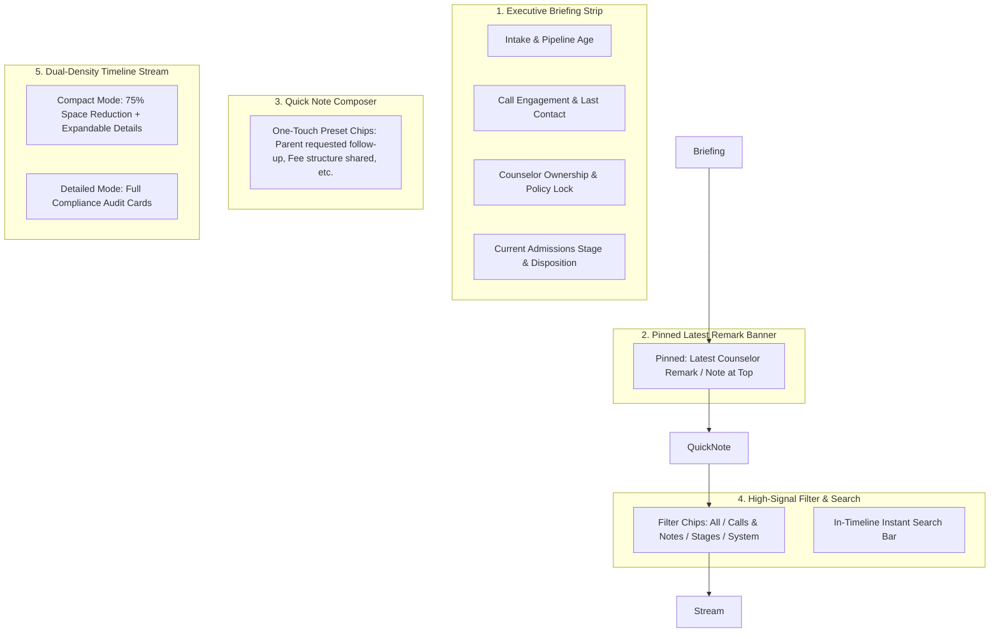

# 📜 Smart Executive Journey & Multi-Density Lead Timeline Guide

This guide covers the redesigned **Smart Executive Journey & Multi-Density Lead Timeline** (`LeadTimeline.tsx`) in DreamDesk CRM, designed to eliminate vertical scrolling fatigue and provide counselors with an instant 3-second briefing before placing admissions consultation calls.

---

## 1. Feature Overview & Problem Solved

### The Problem with Traditional CRM Activity Feeds:
When a student has been in the admissions funnel for 3 months, their activity log can easily grow to 50+ entries (status changes, automated emails, tag edits, call attempts). In traditional CRMs:
- Activity feeds are giant 3,000px vertical card stacks.
- Telecallers spend 45 seconds scrolling through system noise trying to find the one important note left by the previous counselor.
- Phone calls are placed without knowing the student's true context.

### The DreamDesk CRM Solution:
DreamDesk CRM transforms student history into a **high-density executive briefing**:

---

## 2. Component 1: Executive Journey Highlights Strip

At the top of the student's timeline, four high-density metric cards provide an instant 3-second overview:

| Card | Information Displayed | Operational Value |
|---|---|---|
| **Intake & Pipeline Age** | `X Days Active` (or `New Today`) + Origin Campaign (e.g. *Delhi Education Fair*) | Know if the student is a fresh lead or has been waiting for weeks |
| **Call Engagement** | Total Calls Logged + Time since last contact + Last Disposition Outcome | Know immediately if the student has never been called or was called yesterday |
| **Counselor Ownership** | Assigned Counselor Name + 🛡️ Policy Protection Status | Know who owns the student relationship and if ownership is locked |
| **Admissions Stage** | Current Status (e.g. *Interested*) + Sub-Disposition (*Campus Visit Booked*) | Instant context on where the student sits in the enrollment pipeline |

---

## 3. Component 2: Pinned Latest Remark Banner

The most critical piece of information before placing a call is: *“What did the student or parent say the last time we spoke?”*
- The timeline automatically extracts the most recent counselor consultation remark or call observation.
- Pins it in a prominent banner right below the executive strip.
- Telecallers can read the latest remark in 1 second before pressing the call button.

---

## 4. Component 3: Dual-Density Stream Modes

Counselors can toggle between two density views in the upper right corner:

### A. `Compact` Mode (Default — 75% Vertical Space Savings)
- Condenses each event into a sleek, single-line linear row:
  - Action Category Icon: 🟢 `PhoneCall`, 🟣 `StageShift`, 🔵 `ConsultationNote`, 🟢 `Assignment`, ⚪ `SystemTag`.
  - Event title and relative timestamp (`10m ago`, `2h ago`).
  - Truncated 1-line remark preview (`line-clamp-1`).
  - Clickable `[▾ Details]` toggle to reveal full notes, attribute deltas, and metadata on demand.
  - Global **Expand all** and **Collapse all** bulk controls.

### B. `Detailed` Mode
- Full card layout displaying complete remarks, old-to-new transition pills, and ISO timestamps permanently expanded.
- Ideal for administrative compliance audits and deep counseling reviews.

---

## 5. Component 4: Smart Chronological Date Bucketing

Historical events are automatically organized into sticky date dividers:
- 📌 **Today**
- 📌 **Yesterday**
- 📌 **Day of Week** (e.g. *Monday, Oct 6*)
- 📌 **Earlier History** (grouped by month and year)

Eliminates date confusion and highlights the recency of student interactions.

---

## 6. Component 5: High-Signal Filtering & In-Timeline Search

Counselors can cut through system noise using one-click filter chips:

| Filter Chip | What It Shows |
|---|---|
| **`All`** | Complete, unabridged chronological audit log. |
| **`📞 Calls & Notes`** | **High-signal view**: Displays exclusively phone calls, counseling remarks, and WhatsApp conversations. Skips automated system tags and background edits. |
| **`🔄 Stages`** | Pipeline stage shifts and counselor assignment transfers. |
| **`⚙️ System`** | Bulk campaign switches, tag additions, schema field updates, and imports. |

- **In-Timeline Search Bar**: Real-time filtering across titles, counselor remarks, staff names, old/new values, and tags with instantaneous highlighting.

---

## 7. Component 6: Quick Note Composer with One-Touch Preset Chips

Located right above the timeline, counselors can log consultation notes in seconds:

### One-Touch Template Chips:
Clicking any chip automatically inserts standardized notes into the text area:
- `+ Parent requested follow-up call`
- `+ Fee structure shared with student`
- `+ Awaiting document submission`
- `+ Call unanswered / phone switched off`
- `+ Interested in physical campus visit`
- `+ Confirmed application admission intent`

Counselors can add specific notes (e.g., *"Father requested 10% sibling discount"*) and click **"Post Note"** to commit to the timeline immediately.

---

## 8. 🏫 Real-World Use Case Scenarios

### Scenario A: 3-Second Pre-Call Briefing
- **Context**: Telecaller Aditya has 80 calls to make today. He opens Student #204.
- **Workflow**:
  1. Looks at the **Executive Strip**: *Active 14 Days • 2 Calls Logged • Last contacted 3 days ago • Stage: Interested*.
  2. Looks at the **Pinned Latest Remark Banner**: *“Father requested weekend campus visit pass.”*
  3. Presses <kbd>c</kbd> to call.
  4. Greets parent: *"Hello Mr. Sharma, calling from DreamDesk University regarding your weekend campus visit request..."*
- **Result**: Highly personalized, confident call without spending 5 minutes reading through logs.

### Scenario B: Leadership Quality & Compliance Audit
- **Context**: Team Lead Vikram is reviewing why an applicant marked as *High Intent* did not enroll.
- **Workflow**:
  1. Switches timeline density to **Detailed Mode**.
  2. Clicks filter chip: **`📞 Calls & Notes`**.
  3. Inspects full transcripts of all 4 recorded interactions between the student and Counselor Rohit.
  4. Identifies that the student asked about hostel facilities, but no follow-up was provided.
- **Result**: Rapid root-cause discovery for training and admissions quality improvement.
