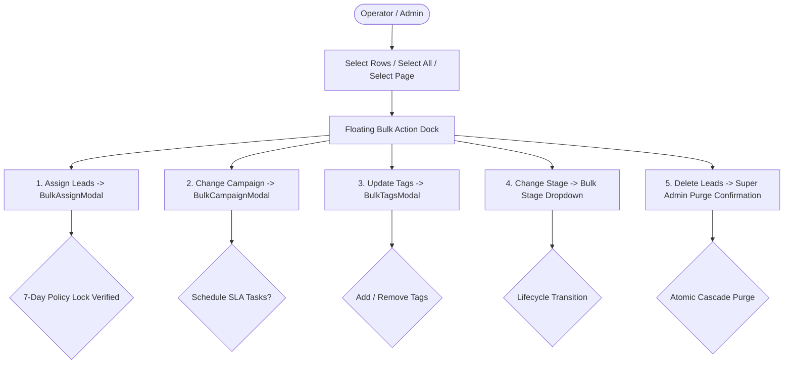

# 🎯 Bulk Operations Suite Guide

This guide covers the **Bulk Operations Suite** in DreamDesk CRM, featuring the floating multi-select action dock, bulk campaign re-attribution, tag studio, admissions stage updater, and multi-page selection management.

---

## 1. Feature Overview & Floating Action Dock

Managing hundreds of thousands of student inquiries requires fast, high-density batch operations. Whenever one or more rows are selected in the leads table, the **Floating Bulk Action Dock** (`BulkActionBar.tsx`) smoothly animates into view at the bottom of the screen:

---

## 2. Multi-Page Selection Preservation

### The Problem in Traditional Tables:
In most web tables, selecting 15 leads on Page 1 and clicking to Page 2 wipes out the selections from Page 1, frustrating operators attempting to assemble cross-page cohorts.

### DreamDesk CRM Architecture:
- Uses a **Set-based selection store** (`setSelectedLeadIds`).
- Navigating across pages preserves checked rows.
- **Select Page**: Toggles only the 50 leads visible on the current page, performing a Set union with existing selections.
- **Select All Filtered**: Clicking *"Select all X filtered leads"* allows batch actions across thousands of records (e.g. 5,000 records) without loading them all into client memory.

---

## 3. Tool 1: Bulk Campaign Switcher (`BulkCampaignModal.tsx`)

*API*: `POST /api/leads/bulk-campaign`

Allows moving selected cohorts into new marketing campaigns (e.g., transitioning applicants who missed the early round into the Regular Round campaign):

### Key Modal Controls:
1. **Target Campaign Selector**: Dropdown showing all active marketing campaigns.
2. **Task Scheduling Integration**:
   - Checkbox: *"Create follow-up tasks for assigned callers"*.
   - Priority Selector: `Urgent` (4h), `High` (12h), `Normal` (24h), `Low` (48h).
   - Task Title Input: e.g. `"Inform student about Regular Round fee discount"`.
3. **Audit History**: Automatically creates a timeline entry on every moved lead:
   `Campaign Changed: Early Bird Drive → Regular Round 2026`.

---

## 4. Tool 2: Bulk Tag Studio (`BulkTagsModal.tsx`)

*API*: `POST /api/leads/bulk-tags`

A visual studio for categorizing student cohorts with multiple operational tags:

### Key Modal Controls:
1. **Mode Toggle**:
   - **`Add Tags`**: Appends selected tags without removing existing tags.
   - **`Remove Tags`**: Strips specific tags from the selected cohort.
   - **`Replace Tags`**: Overwrites all existing tags with the new selection.
2. **Quick Tag Badges**: One-click pills for standard institutional tags:
   - `Hostel Required` • `Scholarship Applicant` • `VIP Referral` • `Local Candidate` • `Fee Sensitive` • `Awaiting 12th Board Results`
3. **Custom Tag Input**: Type any new tag and hit <kbd>Enter</kbd> to apply on the fly.
4. **Follow-up Task Integration**: Optionally spawn tasks for callers to verify the newly tagged criteria.

---

## 5. Tool 3: Bulk Admissions Lifecycle Stage Updater

*API*: `POST /api/leads/bulk-status`

Allows transitioning student lifecycle stages in batch:
- **Available Stages**: `New` ➔ `Contacted` ➔ `Interested` ➔ `Follow-up` ➔ `Admitted` ➔ `Not Interested`.
- **Audit Lineage**: Logs a `stage_change` event on each lead's timeline, capturing old and new status values.

---

## 6. Tool 4: Bulk Delete & Purge Safeguards

*API*: `POST /api/leads/bulk-delete`

A protected administrative tool for permanently purging obsolete or corrupted lead batches:
- **Strict RBAC Enforcement**: Only accessible by users holding the `canDeleteLeads` permission (**Super Admin**).
- **Confirmation Modal**: Requires explicit confirmation showing the exact number of leads to be deleted.
- **Cascade Clean**: Safely removes lead records and cascades deletions to `crm_tasks` and `lead_activities` inside a database transaction.

---

## 7. 🏫 Real-World Use Case Scenarios

### Scenario A: Campaign Re-Targeting After Board Exam Results
- **Context**: 350 students who took the CBSE 12th Board exams were previously tagged `Awaiting 12th Board Results`. The results were declared today.
- **Execution**:
  1. Team Lead filters for `Tag = 'Awaiting 12th Board Results'`.
  2. Selects all 350 leads.
  3. Clicks **Change Campaign** on the floating dock.
  4. Selects *"Post-Board Fast Track Admissions 2026"*.
  5. Schedules tasks: **High Priority (12-hour SLA)**: `"Collect Board marksheet and calculate merit scholarship"`.
- **Result**: All 350 students transition to the new campaign, and counselors receive prioritized tasks in their notification center.

### Scenario B: Regional Campus Visit Tagging
- **Context**: 60 students from North Delhi expressed interest in taking the physical campus bus tour this Saturday.
- **Execution**:
  1. Counselor selects the 60 students.
  2. Opens **Bulk Tag Studio**.
  3. Clicks `+ Campus Visit Saturday` and `+ Bus Route 4`.
  4. Clicks **Apply Tags**.
- **Result**: The transport coordinator can now filter by `Tag = 'Bus Route 4'` and download the passenger manifest in 1 click.
