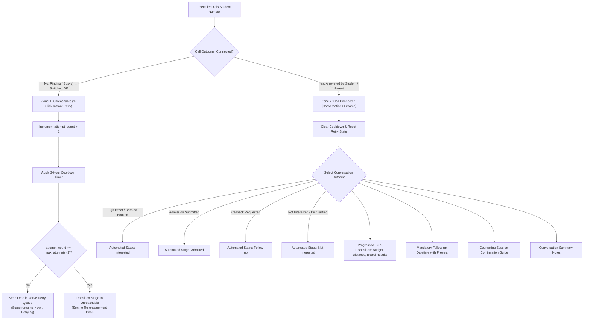

# 📞 Call Dispositions, Retry Cadence & Telecalling Framework

This guide covers the **Telecalling & Counseling Workflow Framework**, **2-Zone Outcome Controller**, **Configurable Retry Cadence**, and **Supervisory Stage Locking** in DreamDesk CRM.

---

## 1. Core Operating Philosophy: "Unreachable Is an Attempt, Not Contact Proof"

In high-volume education admissions, telecallers make 80–150 outreach calls daily. A fundamental flaw of legacy CRMs is marking any dialed number as *"Contacted"*, which:
- Falsely inflates contact and outreach metrics.
- Causes unanswered leads to be abandoned prematurely.
- Skews counselor conversion rates.

### DreamDesk CRM Distinguishes Between:
1. **Call Attempt (Unreachable)**: Ringing No Answer, Busy, Switched Off, Invalid Number.
   - **Does NOT** mark the student as *Contacted*.
   - Increments the student's `attempt_count` (e.g., Attempt #1 of 3).
   - Enforces an automated **cooling-off period** (default: 3 hours) via `cooldown_until`.
   - **Keeps the lead eligible for retries** in the `New` or active retry queue.
   - Only when max retry limits are exhausted (e.g., 3 attempts) is the lead transitioned to the `Unreachable` pool.
2. **Contact Proof (Connected)**: Answered by student or parent.
   - Confirms true two-way communication.
   - Clears any cooldown timers.
   - Progressively transitions the lead to *Interested*, *Follow-up*, *Admitted*, or *Not Interested*.



---

## 2. The 8-Field Telecalling Framework

DreamDesk CRM structures every consultation according to this exact operational matrix:

| Field | Required? | Operating Behavior |
| :--- | :--- | :--- |
| **1. Call Outcome** | **Always** | **Answered vs. Unreachable**. Defines whether contact proof was established or if the interaction was merely an outreach attempt. |
| **2. Disposition** | **Always (when answered)** | Selects the meaningful conversation milestone (*Interested - High Intent*, *Callback Requested*, *Counseling Session Booked*, *Not Interested*). |
| **3. Sub-disposition** | **Conditional** | **Progressively revealed** only when the chosen disposition has relevant sub-reasons (e.g. *Tuition Fee Budget*, *Location / Hostel*, *Comparing Competitors*, *Waiting for Board Results*). |
| **4. Callback Date & Time** | **Conditional** | **Mandatory** only when a follow-up callback is requested. Features 1-tap quick presets: `+2 Hours`, `Tomorrow 11 AM`, `Tomorrow 4 PM`, `Next Monday`. |
| **5. Counseling Booking** | **Conditional** | Appears when *Counseling Session Booked* is selected, prompting the caller to specify campus visit vs. online consultation and remind the student of required 10th/12th marksheets. |
| **6. Notes** | **Conditional / Optional** | Discussion summary and key student takeaways; automatically prefixed with duration and timestamps. |
| **7. Student Details** | **Only When Needed** | Academic parameters (stream, board, score, preferred campus) are editable in the *Fields* tab and identity cards without blocking fast calling. |
| **8. Lead Stage** | **Automatic (CRM-driven)** | **Calculated automatically** from validated rules. Non-supervisory staff (telecallers, counselors) cannot arbitrarily override the stage; manual override requires Supervisor (`admin` or `team_lead`) authorization. |

---

## 3. The 2-Zone Outcome Controller

Both the **Speed Dialer Workspace** (`SpeedDialerWorkspace.tsx`) and the **Student Profile Drawer** (`EnhancedLeadDrawer.tsx`) feature the 2-Zone Outcome Controller:

### Zone 1: Unreachable / Did Not Connect (1-Click Instant Retry)
- **Target Velocity**: < 0.5 seconds per logged attempt.
- **4 Instant Chips**:
  1. 📞 `Ringing - No Answer` (`RNR`)
  2. 📵 `Line Busy / Cut` (`BUSY`)
  3. 📴 `Switched Off / Network` (`SWITCH_OFF`)
  4. 🚫 `Invalid / Wrong Number` (`INVALID_NUM`)
- **Behavior**:
  - 1-click logs the attempt without requiring notes or multi-step wizard modals.
  - Automatically advances to the next student in the queue if auto-advance is toggled on.
  - Registers `call_attempt` audit trail entry with attempt count and cooldown timestamp.

### Zone 2: Call Connected (Student Conversation)
- **Target Velocity**: Structured, comprehensive logging.
- **Visual Categorized Chips**:
  - **Positive / High Intent**: *Admission Form Submitted* (+100 score), *Counseling Session Booked* (+85), *Interested - High Intent* (+70).
  - **Neutral / Follow-up**: *Callback Requested* (+40), *Follow-up Needed* (+30), *Parent Discussion Pending* (+25).
  - **Negative / Disqualified**: *Not Interested* (-20), *Joined Another College* (-50), *Do Not Call (DND)* (-100).
- **Behavior**:
  - Reveals nested sub-disposition dropdowns.
  - Shows dynamic objection-handling talking points (e.g., fee installment plans, scholarship exams, campus bus routes).
  - Validates callback dates before allowing submission.
  - Updates lead stage and lead scoring in real time.

---

## 4. Dialing Cadence, Cooldowns & Policy Configuration

Retry rules are managed via the `crm_policies` database table (`dialer_retry_policy`):

```json
{
  "max_attempts": 3,
  "cooldown_hours": 3,
  "exhausted_status": "Unreachable"
}
```

### Visual Indicators Across the Platform:
- **Card Badges**: `Att #1/3`, `Att #2/3`, `Att #3/3 (Max)`.
- **Active Cooldown Pill**: `⏳ Cooldown` displayed in blue with pulsing animation, showing the time until the lead becomes eligible for re-dialing.
- **Relative Timestamps**: `Last: 12m ago` or `Last: 2h ago` on queue cards and desk headers.

---

## 5. Supervisory Stage Locking & Anti-Pollution Governance

To maintain data integrity and prevent reporting discrepancies, counselors cannot arbitrarily change the lifecycle stage of a lead from dropdowns.

### Governance Rules:
1. **Counselor / Telecaller Mode (`!isExemptRole`)**:
   - The *Admission Stage* selector is locked (`disabled`).
   - A lock badge (`🔒 Auto-Calculated`) explains:
     > *"Stage is calculated automatically by CRM from validated call outcomes. Manual stage overrides require Supervisor (Admin / Team Lead) permission."*
   - Direct API attempts to alter `status` via inline updates are rejected by `leadsService.ts` with a policy violation error.
2. **Supervisor Mode (`admin` / `team_lead`)**:
   - Stage dropdown is fully editable with a `🛡️ Supervisor Override` badge.
   - Any manual stage adjustment is recorded in `lead_activities` with the title:
     `Stage Changed: New → Interested (Supervisor Override)`

---

## 6. Real-World Use Case Scenarios

### Scenario A: Fast Morning Telecalling Run (80 Numbers in 45 Minutes)
- **Operator**: Telecaller working through a fresh batch of 150 inquiries from the Delhi Education Fair.
- **Workflow**:
  1. Opens **Speed Dialer Desk**.
  2. Numbers 1 through 4 ring without an answer. The telecaller clicks **`Ringing - No Answer`** once for each.
  3. In under 2 seconds, all 4 are recorded as `Attempt #1/3` with a 3-hour cooldown, and the desk auto-advances.
  4. Number 5 answers. The telecaller speaks with the candidate, selects **`Interested - High Intent`**, chooses sub-disposition **`Fee Structure Shared`**, and sets a callback for tomorrow at 11 AM.
  5. The lead stage automatically shifts to **`Follow-up`**, clearing all retries.

### Scenario B: Exhaustion & Automated Segregation
- **Student**: Inquires online but never picks up after 3 consecutive attempts spaced across 3 days.
- **System Action**:
  - Attempt 1: Increment to `Att #1/3`, 3h cooldown, stage remains `New`.
  - Attempt 2: Increment to `Att #2/3`, 3h cooldown, stage remains `New`.
  - Attempt 3: Increment to `Att #3/3`. Since max attempts is reached, stage automatically transitions to **`Unreachable`**.
  - Lead is removed from primary caller queues and routed to the **WhatsApp / SMS drip campaign re-engagement pool**.

---

## 7. Technical Schema Reference

### `leads` Table Schema Additions:
```sql
ALTER TABLE leads ADD COLUMN attempt_count INTEGER NOT NULL DEFAULT 0;
ALTER TABLE leads ADD COLUMN last_attempt_at DATETIME;
ALTER TABLE leads ADD COLUMN cooldown_until DATETIME;
ALTER TABLE leads ADD COLUMN call_outcome TEXT;
```

### Key API Endpoints:
- `POST /api/leads/[id]/disposition`: Accepts `{ disposition_id, sub_disposition_id, notes, callback_at, call_outcome }`.
- `PATCH /api/leads/[id]/field`: Validates caller permissions before permitting manual `status` modifications.
