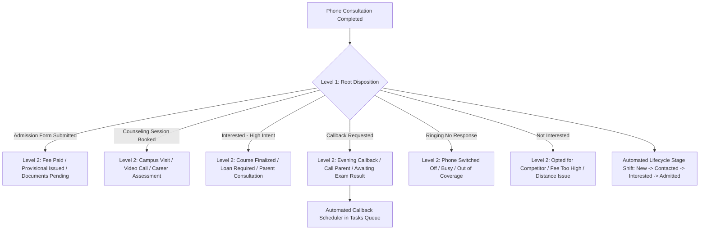

# 📞 Call Dispositions & Nested Sub-Dispositions Guide

This guide covers the **Customizable Call Dispositions & 2-Level Sub-Dispositions Engine** in DreamDesk CRM, designed to standardize call outcomes, automate lifecycle stage progression, and manage phone follow-ups across admissions teams.

---

## 1. Feature Overview & Purpose

In an admissions call center, consistency is critical. If 20 telecallers describe the same phone call as *"Student seemed good"*, *"Might join"*, or *"Call later"*, management cannot predict enrollments or measure conversion rates.

DreamDesk CRM enforces a structured **2-level disposition architecture**:
1. **Level 1: Root Disposition**: Standardized primary outcome with sentiment category and lead scoring.
2. **Level 2: Nested Sub-Disposition**: Contextual detail specifying the exact milestone reached.



---

## 2. Root Disposition Categories & Scoring

Each root disposition has structured metadata:

| Root Disposition | Category | Score Weight | Requires Callback? | Automated Stage Mapping |
|---|---|---|---|---|
| **Admission Form Submitted** | `positive` | `+100` | ❌ No | ➔ **Admitted** |
| **Counseling Session Booked** | `positive` | `+50` | ❌ No | ➔ **Interested** |
| **Interested - High Intent** | `positive` | `+40` | ❌ No | ➔ **Interested** |
| **Callback Requested** | `neutral` | `+10` | ✅ **Yes** | ➔ **Follow-up** |
| **Ringing No Response** | `unreachable` | `0` | ❌ No | ➔ **Contacted** |
| **Call Later / Busy** | `neutral` | `+5` | ✅ **Yes** | ➔ **Follow-up** |
| **Not Interested** | `negative` | `-50` | ❌ No | ➔ **Not Interested** |

- **Lead Scoring**: Positive call outcomes increase the student's lead score, prioritizing high-intent students in filter views.
- **Stage Progression**: Logging a disposition automatically transitions the lead's status (e.g. logging *Admission Form Submitted* transitions status from *Contacted* to *Admitted* without manual status updates).

---

## 3. Two-Level Nested Sub-Dispositions

Sub-dispositions provide granular operational insight:

### Example Breakdown:
- **Root: `Admission Form Submitted`**
  - Sub: `Application Fee Paid`
  - Sub: `Provisional Admission Letter Issued`
  - Sub: `Awaiting 12th Marksheet Submission`
  - Sub: `Scholarship Verification Pending`
- **Root: `Counseling Session Booked`**
  - Sub: `Physical Campus Visit Scheduled`
  - Sub: `Zoom Video Counseling Booked`
  - Sub: `Faculty 1-on-1 Session Requested`
- **Root: `Not Interested`**
  - Sub: `Selected Another Institution` (Competitor)
  - Sub: `Course Stream Not Available`
  - Sub: `Tuition Fee Exceeds Budget`
  - Sub: `Location / Distance Constraint`

---

## 4. Scheduled Callbacks & Task Calendar

When a counselor logs a disposition that requires a follow-up (e.g. *Callback Requested*):
1. A datetime picker appears in the disposition drawer: **Schedule Callback At**.
2. Setting a time (e.g. *Tomorrow, 3:00 PM*) updates `leads.callback_at`.
3. The callback is automatically registered in the counselor's **Tasks & Callbacks Command Center** under the **Due Tomorrow** bucket.
4. When the scheduled time arrives, the counselor receives an in-app alert.

---

## 5. 🏫 Real-World Use Case Scenarios

### Scenario A: Competitor Lost-Reason Analysis
- **Context**: The Dean of Admissions wants to know why 200 students dropped out of the admissions funnel this month.
- **Workflow**:
  1. Opens the **Analytics Dashboard**.
  2. Filters for `Status = 'Not Interested'`.
  3. Inspects the sub-disposition breakdown chart:
     - 62% marked: `Tuition Fee Exceeds Budget`.
     - 24% marked: `Selected Competitor ABC College`.
     - 14% marked: `Location / Distance Constraint`.
- **Strategic Impact**: The university introduces an installment payment plan to solve the 62% fee constraint.

### Scenario B: Campus Visit Manifest
- **Context**: The Campus Relations team is hosting an Open House this Saturday.
- **Workflow**:
  1. Filters leads by `Disposition = 'Counseling Session Booked'` and `Sub-Disposition = 'Physical Campus Visit Scheduled'`.
  2. The table displays 48 students.
  3. Hits **Export CSV** to print visitor badges and parking passes for Saturday morning.

---

## 6. ⚙️ Database Schema Reference

### `dispositions` Table
```sql
CREATE TABLE dispositions (
  id TEXT PRIMARY KEY,
  name TEXT NOT NULL,
  code TEXT UNIQUE NOT NULL,
  category TEXT NOT NULL DEFAULT 'neutral', -- 'positive', 'neutral', 'negative', 'unreachable'
  color TEXT DEFAULT '#3b82f6',
  score INTEGER DEFAULT 0,
  requires_callback INTEGER DEFAULT 0,
  is_active INTEGER DEFAULT 1,
  display_order INTEGER DEFAULT 0,
  created_at DATETIME DEFAULT CURRENT_TIMESTAMP
);
```

### `sub_dispositions` Table
```sql
CREATE TABLE sub_dispositions (
  id TEXT PRIMARY KEY,
  disposition_id TEXT NOT NULL REFERENCES dispositions(id) ON DELETE CASCADE,
  name TEXT NOT NULL,
  code TEXT NOT NULL,
  score INTEGER DEFAULT 0,
  display_order INTEGER DEFAULT 0,
  is_active INTEGER DEFAULT 1,
  created_at DATETIME DEFAULT CURRENT_TIMESTAMP
);
```
