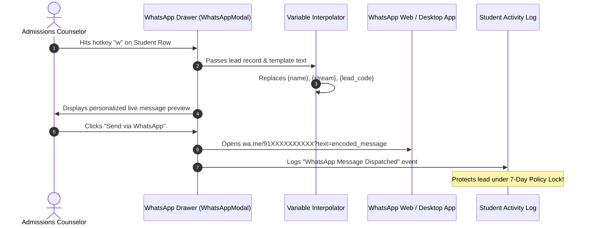

# 💬 WhatsApp & Multi-Channel Communications Guide

This guide covers the **1-Click WhatsApp Integration & Communications Drawer** in DreamDesk CRM, designed to allow admissions counselors to instantly dispatch official brochures, fee structures, and follow-ups with dynamic personalized variable interpolation.

---

## 1. Feature Overview & Purpose

In student admissions, WhatsApp is the highest-engagement communication channel. Students and parents frequently ignore cold emails, but open WhatsApp messages within 3 minutes.

DreamDesk CRM features a native **WhatsApp Communications Drawer**:
- **1-Click Launch**: Press <kbd>w</kbd> or click the green WhatsApp icon on any student row or profile drawer.
- **Dynamic Variable Interpolation**: Automatically replaces placeholders (`{name}`, `{stream}`, `{lead_code}`, `{counselor_name}`) with the student's actual information.
- **Pre-Built Template Library**: Instant template switcher for official brochures, campus visits, scholarship test links, and follow-up reminders.
- **Timeline Audit Tracking**: Every WhatsApp message dispatched writes an interaction log into the student's timeline.



---

## 2. Dynamic Variable Interpolation

The WhatsApp engine dynamically parses and injects student metadata in real-time:

| Placeholder | Replaced With | Example Injected Value |
|---|---|---|
| `{name}` | Student's full name | `Aarav Sharma` |
| `{stream}` | Preferred academic stream | `Computer Science & Engineering` |
| `{lead_code}` | Unique student inquiry code | `LD-001042` |
| `{phone}` | Registered contact number | `+91 98765 43210` |
| `{counselor_name}`| Logged-in counselor's name | `Dr. Priya Sharma` |
| `{callback_at}` | Scheduled callback timestamp | `Tomorrow at 4:30 PM` |

### Raw Template:
```
Hello {name}! Thank you for your interest in the {stream} program at DreamDesk University.
Your application ID is {lead_code}.
I have attached the complete 2026 course curriculum and fee structure brochure: https://admissions.dreamdesk.edu/brochure
Best regards,
{counselor_name}
```

### Interpolated Output:
```
Hello Aarav Sharma! Thank you for your interest in the Computer Science & Engineering program at DreamDesk University.
Your application ID is LD-001042.
I have attached the complete 2026 course curriculum and fee structure brochure: https://admissions.dreamdesk.edu/brochure
Best regards,
Dr. Priya Sharma
```

---

## 3. Pre-Seeded Template Library

The CRM comes pre-configured with standard higher-education templates:

1. **Official Admission Brochure & Fee Structure**:
   - Dispatches download links, curriculum highlights, and annual fee schedule.
2. **Counseling Session & Campus Visit Confirmation**:
   - Confirms visit date, campus location GPS link, and parking gate pass.
3. **Scholarship Aptitude Test Invitation**:
   - Shares online test registration portal, syllabus, and exam instructions.
4. **Follow-up / Unanswered Call Note**:
   - Courteous notice: *"Tried reaching you regarding your application. Please let me know when you're available for a quick 5-minute call."*

---

## 4. Direct Softphone & Click-to-Call (`tel:`)

Beside WhatsApp, the CRM provides desktop softphone and mobile dialing:
- **Hotkey Dialing**: Press <kbd>c</kbd> on any row or inside the profile drawer to trigger click-to-call immediately.
- **Protocol**: Triggers standard `tel:+91XXXXXXXXXX` URI, opening Microsoft Teams, Skype, MicroSIP, or the default mobile dialer.
- **Call Disposition Trigger**: After hanging up, the disposition drawer automatically prompts the counselor to log the outcome.

---

## 5. 🏫 Real-World Use Case Scenarios

### Scenario A: Instant Post-Call Brochure Dispatch
- **Context**: Counselor Sneha finishes a 12-minute phone consultation with a parent who requests the Aerospace Engineering fee schedule.
- **Workflow**:
  1. Closes phone call.
  2. Presses <kbd>w</kbd> on the active student.
  3. Selects template: *"Aerospace Engineering Fee Structure & Hostel Guide"*.
  4. Clicks **Send via WhatsApp**.
- **Result**: The parent receives the exact requested document within 10 seconds while the phone conversation is fresh in their mind.

### Scenario B: Mass Unanswered Call Re-Engagement
- **Context**: Telecaller Aditya places 20 outbound calls in the morning; 8 students do not answer.
- **Workflow**:
  1. For each unanswered call, logs disposition: `Ringing No Response`.
  2. Hits <kbd>w</kbd> and selects template: *"Missed Call Follow-up"*.
  3. Dispatches message with single click.
- **Result**: Over 40% of students reply on WhatsApp within the hour requesting an evening callback.

---

## 6. ⚙️ Database Schema Reference

### `whatsapp_templates` Table
```sql
CREATE TABLE whatsapp_templates (
  id TEXT PRIMARY KEY,
  name TEXT NOT NULL,
  category TEXT NOT NULL DEFAULT 'General',
  template_body TEXT NOT NULL,
  is_default INTEGER DEFAULT 0,
  created_at DATETIME DEFAULT CURRENT_TIMESTAMP
);
```
