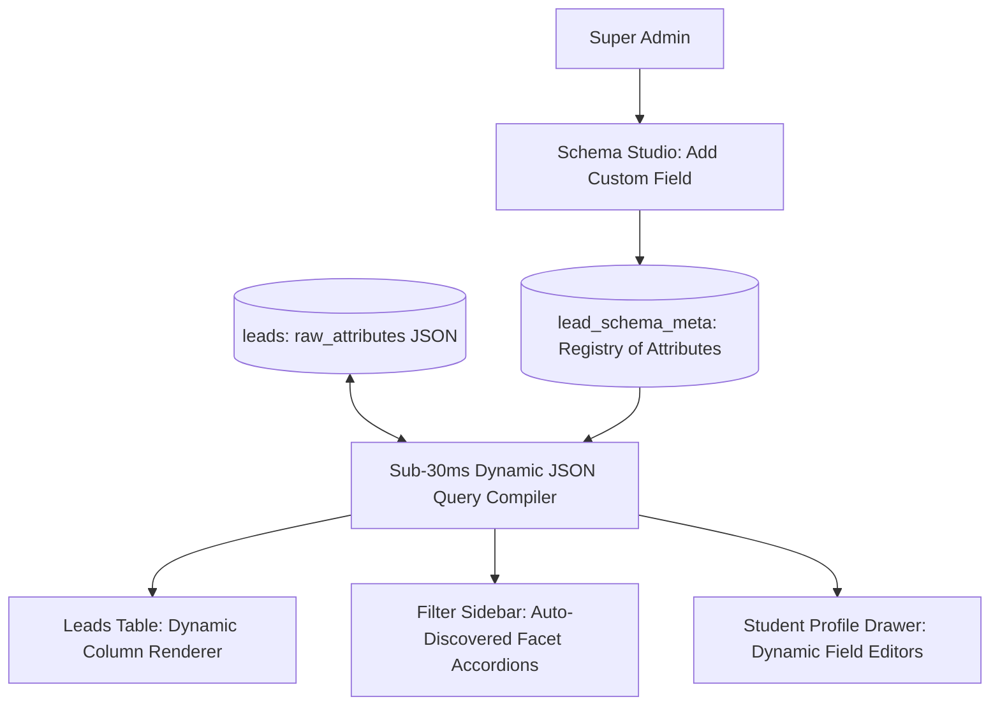

# 🧩 Dynamic Schema Studio & Custom Attributes Guide

This guide covers the **Dynamic Schema Studio** in DreamDesk CRM, explaining how administrators can create, reorder, hide, and filter custom student fields on the fly without database migrations or engineering downtime.

---

## 1. Feature Overview & Architecture

### The Problem in Traditional CRMs:
Whenever an admissions department needs to capture a new student attribute (e.g. *JEE Percentile*, *NEET Score*, *Hostel Accompaniment*, *Parent Occupation*, *State Quota*):
- Traditional SQL databases require running `ALTER TABLE` migrations.
- Migrations lock tables, risk downtime, and clutter the schema with dozens of sparse, empty columns.
- The software developer must write custom UI forms, filter dropdowns, and table columns.

### The DreamDesk CRM Solution:
DreamDesk CRM uses a **Dynamic Schema Discovery Architecture**:
1. **Normalized Core Columns**: Essential fields (`name`, `phone`, `email`, `status`, `assigned_to`, `campaign_id`, `disposition_id`) are indexed at the SQL level for sub-millisecond lookups.
2. **Semi-Structured Dynamic Attributes**: All custom and domain-specific fields are stored in a normalized JSON document in `leads.raw_attributes`.
3. **Registry of Schema Metadata (`lead_schema_meta`)**: Maintains labels, data types, visibility, filter types, and display ordering.
4. **Automatic Faceted Discovery**: Any field marked `is_filterable = 1` **automatically appears as a faceted filter in the left sidebar and top toolbar** without writing a single line of frontend code.



---

## 2. Managing Custom Fields in Schema Studio

*Component*: [`SchemaStudioWorkspace.tsx`](file:///C:/Users/Ramanuj%20Dey%20Sarkar/Desktop/New%20folder%20%282%29/DreamDesk%20CRM/src/components/crm/SchemaStudioWorkspace.tsx) | API: `GET / POST / PATCH /api/schema`

Administrators can navigate to the **Schema Studio** tab to manage custom student attributes:

### Configurable Field Properties:
| Property | Description | Example |
|---|---|---|
| **Key Name** | Unique internal identifier (snake_case) | `jee_percentile`, `hostel_required` |
| **Display Label** | User-facing column header & drawer title | `JEE Percentile`, `Hostel Required` |
| **Data Type** | Data validation rule: `string`, `number`, `boolean`, `date`, `select` | `number` for percentiles, `boolean` for hostel |
| **Is Filterable** | Toggles whether this field generates a faceted filter | `1` (Active filter) |
| **Filter Type** | Filter UI style: `faceted` (multi-select checklist) or `range` (min/max slider) | `faceted` |
| **Is Visible** | Default column visibility in the main table | `1` (Visible) |
| **Display Order** | Integer determining left-to-right table column order | `1`, `2`, `3`... |

---

## 3. Automatic Faceted Filter Discovery

When an attribute is added to the Schema Studio:
1. The backend compiler inspects `lead_schema_meta`.
2. Gathers distinct values from `leads.raw_attributes` with real-time student counts.
3. Automatically renders an interactive facet group in [`FilterSidebar.tsx`](file:///C:/Users/Ramanuj%20Dey%20Sarkar/Desktop/New%20folder%20%282%29/DreamDesk%20CRM/src/components/crm/FilterSidebar.tsx):
   - Example:
     ```
     ▼ Preferred Stream
       ☑ Computer Science & Engineering (1,420)
       ☐ Mechanical Engineering (890)
       ☐ Biotechnology (340)
       ☐ Artificial Intelligence & Data Science (1,150)
     ```
4. Clicking any checkbox immediately filters the 500,000+ lead database in **sub-30ms**.

---

## 4. 🏫 Real-World Use Case Scenarios

### Scenario A: Adding "NEET Score" for Medical Admissions
- **Context**: The Medical Faculty announces that applicants must submit their NEET percentile score for the upcoming round.
- **Workflow**:
  1. Super Admin opens **Schema Studio**.
  2. Clicks **+ Add Field**:
     - *Key*: `neet_score`
     - *Label*: `NEET Score (Percentile)`
     - *Type*: `number`
     - *Filterable*: `Yes`
  3. Clicks **Save**.
- **Result**:
  - The column immediately appears in the Leads Table.
  - Counselors can edit the score directly in the Student Profile Drawer.
  - The Left Sidebar now features a `NEET Score` filter.
  - Zero server restarts or database migrations required.

### Scenario B: Tracking Transport & Bus Route Preferences
- **Context**: The campus introduces 4 new bus routes and needs to track student transportation needs.
- **Workflow**:
  1. Admin adds field: `transport_bus_route` with label *"Preferred Bus Route"*.
  2. Batch imports a transport survey CSV. The CRM's header auto-mapping automatically recognizes the column and links it to the schema.
  3. Admissions staff can now filter by *Route 3 (Gurgaon Express)* in one click.

---

## 5. ⚙️ Database Schema Reference

### `lead_schema_meta` Table
```sql
CREATE TABLE lead_schema_meta (
  id TEXT PRIMARY KEY,
  key_name TEXT UNIQUE NOT NULL,       -- Internal attribute key
  display_label TEXT NOT NULL,         -- Header label
  data_type TEXT NOT NULL DEFAULT 'string', -- 'string', 'number', 'boolean', 'date'
  is_filterable INTEGER NOT NULL DEFAULT 1,
  filter_type TEXT NOT NULL DEFAULT 'faceted',
  is_visible INTEGER NOT NULL DEFAULT 1,
  display_order INTEGER NOT NULL DEFAULT 0,
  created_at DATETIME DEFAULT CURRENT_TIMESTAMP
);
```

### Pre-Seeded Dynamic Attributes:
- `stream`: Preferred academic discipline (*Computer Science*, *Biotechnology*, *Management*)
- `city`: Candidate residence city (*Delhi*, *Mumbai*, *Bangalore*, *Hyderabad*)
- `board`: Secondary education board (*CBSE*, *ICSE*, *State Board*, *IB*)
- `score`: Academic merit score or entrance percentile
- `preferred_campus`: Selected branch or satellite campus
