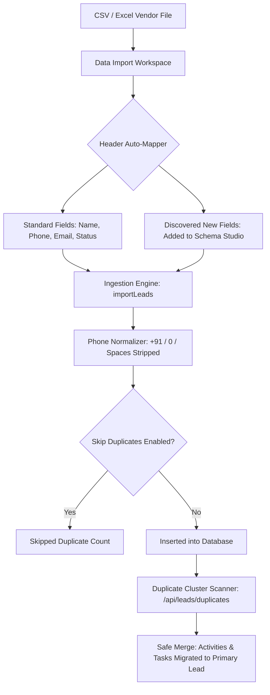

# 📥 Data Import, Deduplication & Clean Ingestion Guide

This guide covers the **Batch Ingestion Pipeline**, **Intelligent Header Auto-Mapping**, and **Zero-Data-Loss Duplicate Resolution Engine** in DreamDesk CRM.

---

## 1. Feature Overview & Purpose

Universities receive student leads from dozens of external sources: school visits, digital ads, education web portals (Shiksha, Collegedunia), and third-party agencies. This creates two massive operational challenges:
1. **Header Format Chaos**: Every vendor sends files with different column headers (*"Student Name"* vs *"Full Name"*, *"Mobile"* vs *"Contact Number"*).
2. **Duplicate Records & Data Fragmentation**: Students frequently register 3 or 4 times across different portals. Traditional CRMs either reject the file or duplicate the student, leading to two counselors calling the same student independently.

DreamDesk CRM solves this with:
- **Visual Column Auto-Mapper**: Automatically recognizes header synonyms and discovers new custom columns.
- **10-Digit Normalized Deduplication**: Strips formatting variations (`+91`, `91`, leading `0`, spaces, dashes) to catch duplicates accurately.
- **Safe Duplicate Merging (Zero Data Loss)**: Consolidates duplicate records into one primary profile while re-parenting 100% of past call logs, consultation remarks, and tasks.



---

## 2. Component 1: Intelligent Header Auto-Mapping

When an operator uploads a CSV or Excel sheet:
1. The system inspects column headers and matches standard fields automatically:
   - `name`, `student_name`, `full_name`, `candidate` ➔ **Name**
   - `phone`, `mobile`, `contact`, `number`, `cell` ➔ **Phone**
   - `email`, `student_email`, `mail_id` ➔ **Email**
   - `status`, `stage`, `lifecycle` ➔ **Status**
   - `campaign`, `utm_source`, `source` ➔ **Campaign**
2. **Dynamic Header Discovery**:
   - Any unknown column (e.g. `hostel_required`, `parent_income`, `diploma_percentage`) is automatically identified.
   - The operator can map it to an existing schema key, create a new dynamic field on the fly, or select `__skip__`.

---

## 3. Component 2: 10-Digit Standardized Phone Normalization

*Implementation*: [`normalizePhoneNumber`](file:///C:/Users/Ramanuj%20Dey%20Sarkar/Desktop/New%20folder%20%282%29/DreamDesk%20CRM/src/lib/services/leadsService.ts#L35)

Phone numbers entered on web forms come in unpredictable formats:
- `+91 98765 43210`
- `919876543210`
- `09876543210`
- `98765-43210`
- `9876543210`

The normalization engine strips all non-digits, strips country code prefixes (`+91` or `91`), removes leading zeros, and extracts the standardized **10-digit number**:
```typescript
export function normalizePhoneNumber(phone?: string | null): string {
  if (!phone) return "";
  const cleaned = phone.replace(/[^0-9]/g, "");
  if (cleaned.length === 12 && cleaned.startsWith("91")) return cleaned.slice(2);
  if (cleaned.length === 11 && cleaned.startsWith("0")) return cleaned.slice(1);
  if (cleaned.length > 10) return cleaned.slice(-10);
  return cleaned;
}
```
Both the CSV ingestion pre-check and the database duplicate scanner use this identical normalized logic, guaranteeing 100% duplicate detection accuracy.

---

## 4. Component 3: Safe Duplicate Merging (Zero Data Loss)

*Component*: [`DuplicatesModal.tsx`](file:///C:/Users/Ramanuj%20Dey%20Sarkar/Desktop/New%20folder%20%282%29/DreamDesk%20CRM/src/components/crm/DuplicatesModal.tsx) | API: `POST /api/leads/duplicates`

When duplicate inquiries exist in the database (e.g. a student registered once via Google Ads and once via an education expo):
1. **Cluster Detection**: The scanner groups duplicate leads by normalized phone number or email address, showing which counselor owns each record.
2. **Primary Record Selection**: The administrator selects which record survives as the primary profile (typically the record with the most counseling progress).
3. **Attribute Consolidation**: Notes, custom attributes, and lead scores from duplicate records are merged into the primary profile without overwriting existing data.
4. **Historical Activity & Task Re-Parenting**:
   - Before duplicate rows are deleted from the database, the engine re-parents foreign keys:
     ```sql
     UPDATE lead_activities SET lead_id = primaryLeadId WHERE lead_id IN (...duplicateIds);
     UPDATE crm_tasks SET lead_id = primaryLeadId WHERE lead_id IN (...duplicateIds);
     ```
   - **Result**: Zero past phone calls, notes, or scheduled callbacks are lost. The student's complete relationship history is united under one profile.

---

## 5. 🏫 Real-World Use Case Scenarios

### Scenario A: Ingesting 15,000 Leads from an Education Portal
- **Context**: An agency delivers a CSV with 15,000 leads. Approximately 2,000 students have already inquired directly on the university website.
- **Workflow**:
  1. Operations manager opens **Data Import**.
  2. Selects file: `shiksha_engineering_leads_october.csv`.
  3. Selects campaign: *"Online Portal Inflow"*.
  4. Checks: ☑ **Skip Duplicates (Match Phone)**.
  5. Clicks **Start Ingestion**.
- **Result**:
  - 13,000 fresh leads are imported and assigned lead codes (`LD-XXXXXX`).
  - 2,000 duplicate inquiries are safely skipped, preventing duplicate records.
  - The entire batch imports in under 3.5 seconds.

### Scenario B: Unifying Fragmented Student Inquiries
- **Context**: Student Aarav Patel submitted an inquiry in January (assigned to Counselor Sneha) and another inquiry in March with a different email address (assigned to Counselor Rohit).
- **Workflow**:
  1. Team Lead opens the **Duplicate Inquiries Studio**.
  2. The system flags the cluster: `Phone: 9876543210 (2 Records Found)`.
  3. Team Lead selects Sneha's profile as the primary surviving record.
  4. Clicks **Merge Records**.
- **Result**:
  - Rohit's duplicate row is safely retired.
  - All notes and calls placed by both counselors are merged into the unified timeline.
  - Sneha continues counseling the student with complete visibility into all past interactions.
