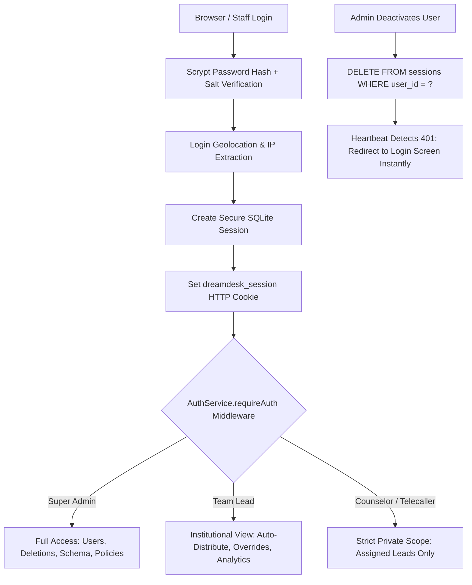

# 🔐 RBAC, Security, Geolocation & User Management Guide

This guide covers the **Role-Based Access Control (RBAC)**, **Session Security**, **Instant User Deactivation Protocol**, and **Login Geolocation Auditing** in DreamDesk CRM.

---

## 1. Feature Overview & Institutional Governance

Educational institutions manage sensitive student records, parent financial information, and entrance exam percentiles. DreamDesk CRM enforces strict institutional data isolation:
- **Zero Cross-Counselor Data Leakage**: Counselors only see and interact with student leads assigned directly to them.
- **Instant Deactivation**: Departing or compromised staff accounts can be locked out in 1 click, instantly terminating all active browser sessions.
- **Tamper-Evident Audit Trails**: Every login records IP addresses, approximate geographic location, and ISP details.
- **Cryptographic Security**: Passwords use Scrypt key derivation with cryptographically random 16-byte salts.



---

## 2. 5-Tier Role Hierarchy & Permissions Matrix

*Defined in*: [`src/lib/services/authService.ts`](file:///C:/Users/Ramanuj%20Dey%20Sarkar/Desktop/New%20folder%20%282%29/DreamDesk%20CRM/src/lib/services/authService.ts#L20)

| Permission | Super Admin | Team Lead | Senior Counselor | Counselor | Telecaller |
|---|:---:|:---:|:---:|:---:|:---:|
| **View Institutional Leads (500k+)** | ✅ Yes | ✅ Yes | ❌ Private Only | ❌ Private Only | ❌ Private Only |
| **Export Lead Reports to CSV** | ✅ Yes | ✅ Yes | ❌ Blocked | ❌ Blocked | ❌ Blocked |
| **Delete Leads (Bulk / Single)** | ✅ **Yes** | ❌ Blocked | ❌ Blocked | ❌ Blocked | ❌ Blocked |
| **Manage Custom Schema (Studio)** | ✅ **Yes** | ❌ Blocked | ❌ Blocked | ❌ Blocked | ❌ Blocked |
| **Manage Marketing Campaigns** | ✅ Yes | ✅ Yes | ❌ Blocked | ❌ Blocked | ❌ Blocked |
| **Configure Call Dispositions** | ✅ Yes | ✅ Yes | ❌ Blocked | ❌ Blocked | ❌ Blocked |
| **Staff Management (Add / Deactivate)**| ✅ **Yes** | ❌ Blocked | ❌ Blocked | ❌ Blocked | ❌ Blocked |
| **Data Import (CSV / Excel)** | ✅ Yes | ✅ Yes | ❌ Blocked | ❌ Blocked | ❌ Blocked |
| **Lead Allocation & Auto-Distribute** | ✅ Yes | ✅ Yes | ❌ Blocked | ❌ Blocked | ❌ Blocked |
| **Override 7-Day Policy Lock** | ✅ **Yes** | ✅ **Yes** | ❌ Blocked | ❌ Blocked | ❌ Blocked |
| **System-Wide Activity & Audit Logs** | ✅ **Yes** | ❌ Blocked | ❌ Blocked | ❌ Blocked | ❌ Blocked |

---

## 3. Strict Private Leads Scoping & IDOR Prevention

### How Scoping is Enforced:
When a counselor or telecaller queries leads ([`GET /api/leads`](file:///C:/Users/Ramanuj%20Dey%20Sarkar/Desktop/New%20folder%20%282%29/DreamDesk%20CRM/src/app/api/leads/route.ts)):
1. `AuthService.requireAuth` verifies the session and inspects `session.permissions.canViewAllLeads`.
2. If `canViewAllLeads` is `false`, the query compiler strictly forces:
   ```typescript
   finalAssignedTo = [session.user.id];
   ```
3. Even if the counselor modifies the URL query parameter (`?assigned_to=usr_other`), the backend server overwrites it with their own user ID.
4. **Endpoint IDOR Guard**: All individual mutation endpoints (`/api/leads/[id]/activities`, `/api/leads/[id]/disposition`, `/api/tasks/[id]`) verify that the student belongs to the authenticated user before executing updates.

---

## 4. Instant User Deactivation & Real-Time Session Purging

*Implementation*: [`AuthService.deactivateUser`](file:///C:/Users/Ramanuj%20Dey%20Sarkar/Desktop/New%20folder%20%282%29/DreamDesk%20CRM/src/lib/services/authService.ts#L312) | API: `PATCH /api/users`

### What Happens When an Account is Deactivated:
1. **Status Update**: Marks `users.status = 'inactive'`, records `deactivated_at = CURRENT_TIMESTAMP`, and captures the administrator's identity.
2. **Instant Session Purge**: Executes:
   ```sql
   DELETE FROM sessions WHERE user_id = ?
   ```
   Instantly destroying every active session record across desktop, laptop, and mobile devices.
3. **Real-Time Client Lockout**: The client-side heartbeat detects the resulting `401 Unauthorized` response within seconds and immediately redirects the user to the login screen.
4. **Self-Protection Safeguard**: Administrators cannot deactivate their own account or the primary Super Admin (`usr_admin`).

---

## 5. Login Geolocation & IP Audit Logging

On every staff authentication:
- Captures client IP address (`x-forwarded-for` or socket remote address).
- Resolves approximate city, region, and ISP.
- Updates `users.last_login_at`, `users.last_login_ip`, and `users.last_login_location`.
- Writes a permanent audit record into `activity_logs`:
  `Vikram Malhotra logged in from New Delhi, India (103.21.124.5)`.

---

## 6. 🏫 Real-World Use Case Scenarios

### Scenario A: Terminating Departing Counselor with Zero Data Leakage
- **Context**: A counselor resigns to join a competitor institution. The university must ensure they cannot download or access student phone numbers from home.
- **Workflow**:
  1. Super Admin opens **Team Management**.
  2. Locates counselor account and toggles status to **Inactive**.
  3. The system immediately purges 3 active sessions across the counselor's devices.
  4. The counselor's open browser window immediately kicks them to the login screen.
- **Result**: Immediate zero-trust data protection with full compliance logging.

### Scenario B: Security Review of Remote Login
- **Context**: An administrator notices unusual nighttime activity.
- **Workflow**:
  1. Super Admin opens the **Activity Logs** tab.
  2. Filters by `Action = 'USER_LOGIN'`.
  3. Inspects login locations and timestamps for all staff members.
- **Result**: Complete data provenance and security auditing.

---

## 7. ⚙️ Database Schema Reference

### `users` Table
```sql
CREATE TABLE users (
  id TEXT PRIMARY KEY,
  name TEXT NOT NULL,
  email TEXT UNIQUE NOT NULL,
  role TEXT NOT NULL DEFAULT 'counselor',
  status TEXT NOT NULL DEFAULT 'active',      -- 'active', 'inactive'
  avatar_color TEXT DEFAULT '#3b82f6',
  password_hash TEXT,
  salt TEXT,
  last_login_at DATETIME,
  last_login_ip TEXT,
  last_login_location TEXT,
  deactivated_at DATETIME,
  deactivated_by TEXT,
  created_at DATETIME DEFAULT CURRENT_TIMESTAMP
);
```

### `sessions` Table
```sql
CREATE TABLE sessions (
  id TEXT PRIMARY KEY,
  user_id TEXT NOT NULL REFERENCES users(id) ON DELETE CASCADE,
  ip_address TEXT,
  location TEXT,
  user_agent TEXT,
  created_at DATETIME DEFAULT CURRENT_TIMESTAMP,
  expires_at DATETIME NOT NULL
);
```
