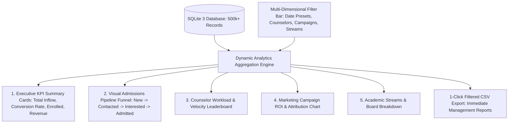

# 📊 Executive Analytics Dashboard & Reporting Guide

This guide covers the **Multi-Dimensional Analytics Dashboard & Reporting Suite** in DreamDesk CRM, designed to provide institutional leadership with real-time visibility into admissions velocity, counselor productivity, and campaign conversion rates.

---

## 1. Feature Overview & Architecture

Higher-education marketing and admissions involve multi-channel campaigns (Google Ads, Facebook, school expos, alumni referrals). Leadership must know:
- Which marketing channels produce paying enrollments vs dead inquiries?
- Which counselors maintain the highest consultation velocity and conversion ratios?
- Where are students dropping out in the admissions funnel?

DreamDesk CRM features an **Executive Analytics Dashboard** powered by sub-30ms aggregation queries across 500,000+ student records:

---

## 2. Multi-Dimensional Filter Controls

The dashboard features multi-dimensional filtering, allowing management to slice analytics datasets:

### A. Date Presets & Custom Date Ranges
- 📅 **Today** • **Yesterday** • **Last 7 Days** • **Last 30 Days** • **This Quarter** • **This Year**
- 📆 **Custom Date Picker**: Precise start and end date boundaries down to the day.

### B. Counselor Workload Scope
- Filter by individual counselors or compare team cohorts against each other.

### C. Campaign Attribution
- Filter by specific marketing initiatives (e.g. *Delhi Fair 2026*, *Google Search STEM*, *Direct Walk-ins*).

### D. Academic Stream & Board Filters
- Segment performance by academic board (CBSE, ICSE, State Board) and discipline (Engineering, Medical, Commerce, Arts).

---

## 3. Core Analytics Visualizations

### 1. Executive KPI Metrics Cards
- **Total Inflow**: Total leads created within the selected period.
- **Conversion Velocity**: Percentage of inquiries converted to `Admitted` status.
- **Active Pipeline**: Total leads currently in `Interested` or `Follow-up` stages.
- **Average Response Time**: Time elapsed between lead generation and first logged call.

### 2. Admissions Pipeline Funnel
Interactive funnel chart tracking dropout rates across each admissions milestone:
1. `New Inquiry` (100%)
2. `Contacted` (78%)
3. `Interested - High Intent` (42%)
4. `Application Submitted` (26%)
5. `Admitted / Fee Paid` (18%)

### 3. Counselor Throughput Leaderboard
Comparative staff performance table:
- Calls Logged per Day
- Average Call Duration
- Conversion Rate (%)
- Overdue Callback Count

### 4. Marketing Campaign Conversion Chart
Bar and pie charts displaying:
- Inquiry Volume per Campaign
- Confirmed Enrollments per Campaign
- Cost per Enrolled Student (ROI)

---

## 4. 1-Click CSV Export & Reporting

*Endpoint*: `GET /api/analytics/report`

At any time, leadership can download a customized admissions report:
1. Apply desired filters (e.g., *Last 30 Days • Engineering • Campaign: Google Ads*).
2. Click **"Export CSV"** in the upper right corner.
3. The server generates a clean, formatted CSV with all student details, consultation remarks, and counselor attributions in under 1 second.

---

## 5. 🏫 Real-World Use Case Scenarios

### Scenario A: Weekly Executive Dean's Review
- **Context**: The Dean of Admissions meets with the Chancellor every Monday at 9:00 AM to review progress against enrollment targets.
- **Workflow**:
  1. Opens the **Analytics Dashboard**.
  2. Selects date preset: **Last 7 Days**.
  3. Reviews total inquiries (1,240) and confirmed admissions (84).
  4. Clicks **Export CSV** to generate the executive report for the Chancellor's binder.
- **Result**: Immediate data-backed strategic visibility without waiting for manual Excel preparation.

### Scenario B: Counselor Incentive & Bonus Calculations
- **Context**: End-of-month counselor commission distribution based on conversion rate and call volume.
- **Workflow**:
  1. Team Lead filters by date: **This Month**.
  2. Inspects the **Counselor Throughput Leaderboard**.
  3. Counselor Sneha Rao ranks #1 with 480 calls logged and a 22.4% conversion rate.
- **Result**: Transparent, tamper-evident performance ranking.

---

## 6. ⚙️ Technical Engine Reference

- **Aggregations**: Calculated directly inside optimized SQLite indexed queries with memory caching.
- **Response Latency**: <30ms query time across 500,000+ lead records.
- **Recharts Integration**: Responsive SVG/Canvas rendering with tooltips and smooth transitions.
