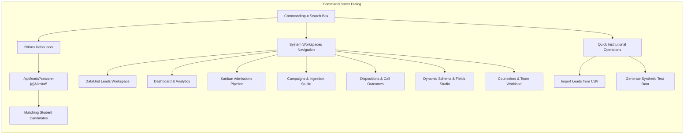
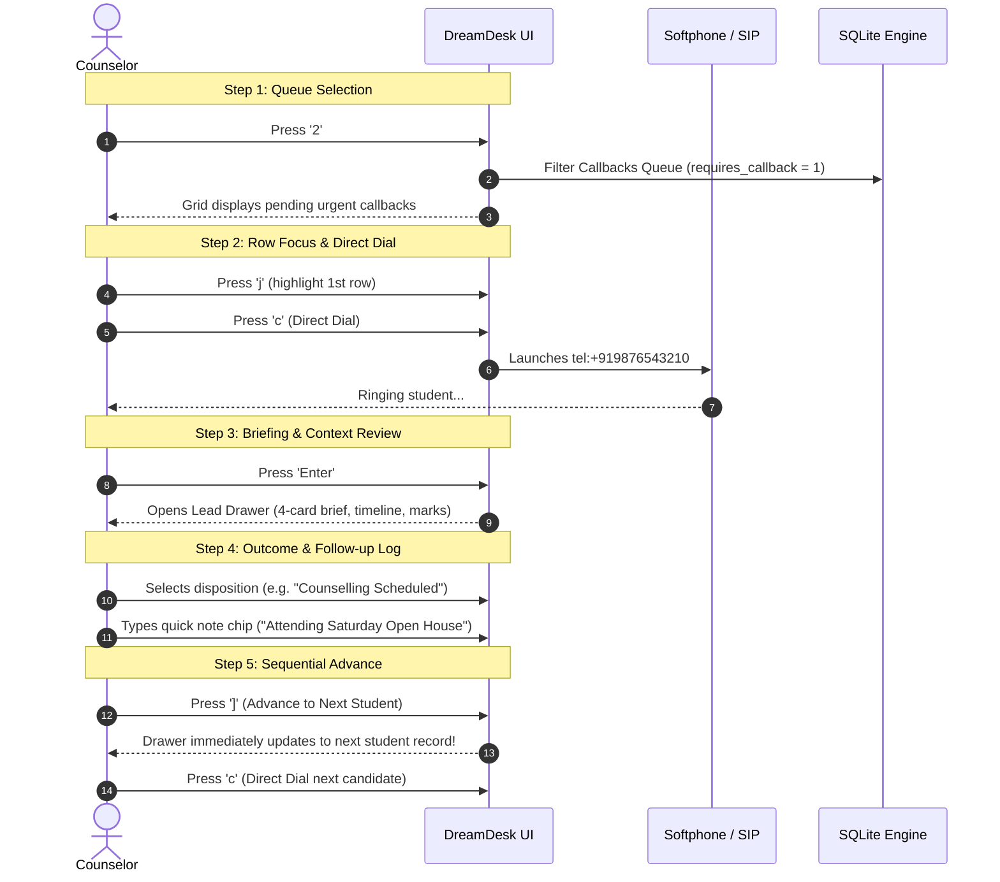

# ⚡ Productivity Hotkeys, Global Command Center & Operator Fast-Paths

## 1. Overview & Operational Purpose

In high-volume higher-education admissions environments, telecallers and senior counselors frequently dial between **80 and 150 student leads per day**. Standard mouse-driven navigation—clicking rows, opening drawers, searching fields, switching tabs, clicking phone icons, and closing modals—introduces **3 to 8 seconds of friction per call**. Across 120 calls daily, this overhead burns over 15 minutes of productive time per counselor and causes severe wrist and cognitive fatigue.

DreamDesk CRM features an enterprise-grade, **keyboard-first productivity suite** that empowers admissions counselors to navigate student databases, dial candidates, send WhatsApp updates, toggle queues, and log call outcomes **without lifting their hands off the keyboard**.

### Core Objectives
1. **Zero-Mouse Telecalling Flow**: Enable telecallers to complete 100+ outbound interactions daily using single-stroke hotkeys (<kbd>c</kbd>, <kbd>w</kbd>, <kbd>j</kbd>, <kbd>k</kbd>, <kbd>[</kbd>, <kbd>]</kbd>).
2. **Instant Omnibox Command Center (<kbd>Ctrl+K</kbd> / <kbd>Cmd+K</kbd>)**: Instant fuzzy-search by student name, application code (`APP-2025-XXXX`), or phone number with sub-20ms rendering.
3. **1-Key Queue Triage**: Instantly switch between critical work queues (<kbd>1</kbd> All Leads, <kbd>2</kbd> Callbacks, <kbd>3</kbd> Unassigned Pool, <kbd>4</kbd> High Intent) with single keystrokes.
4. **Context-Safe Event Isolation**: Smart keystroke interception that automatically disables hotkeys when typing in search bars, remarks fields, or notes, ensuring zero accidental triggers.

---

## 2. Master Hotkey Reference Matrix

| Category | Shortcut | Key / Combo | Action Description | Behavioral Context |
|---|---|---|---|---|
| **Global Command** | Open Command Center | <kbd>Ctrl</kbd> + <kbd>K</kbd> or <kbd>⌘</kbd> + <kbd>K</kbd> | Opens omnibox command palette with lead search & app navigation | Global anywhere in CRM |
| **Search & Focus** | Focus Search Bar | <kbd>/</kbd> | Instantly moves cursor to the table search bar | Table workspace |
| **Search & Focus** | Clear Focus / Blur | <kbd>Esc</kbd> | Unfocuses active text input, closes modals, or closes open drawer | Any open input or drawer |
| **Cheat Sheet** | Open Hotkeys Help | <kbd>?</kbd> | Opens the interactive visual Keyboard Shortcuts modal | Global anywhere in CRM |
| **Queue Switchers** | All Leads Queue | <kbd>1</kbd> | Switches work queue tab to **All Leads** and clears active queue filters | Workspace header |
| **Queue Switchers** | Urgent Callbacks Queue | <kbd>2</kbd> | Filters table to leads flagged with `requires_callback = 1` or scheduled follow-ups | Workspace header |
| **Queue Switchers** | Unassigned Pool | <kbd>3</kbd> | Filters table to leads currently having no counselor assigned (`unassigned`) | Workspace header |
| **Queue Switchers** | High Intent Leads | <kbd>4</kbd> | Filters table to candidates with engagement score $\ge 60$ or positive dispositions | Workspace header |
| **Row Navigation** | Next Lead Row | <kbd>j</kbd> or <kbd>↓</kbd> | Shifts active row highlight down to the next candidate in the grid | Leads DataGrid |
| **Row Navigation** | Previous Lead Row | <kbd>k</kbd> or <kbd>↑</kbd> | Shifts active row highlight up to the previous candidate in the grid | Leads DataGrid |
| **Row Selection** | Toggle Checkbox | <kbd>x</kbd> or <kbd>Space</kbd> | Toggles the bulk selection checkbox for the currently highlighted lead row | Leads DataGrid |
| **Lead Inspection** | Open Lead Profile | <kbd>Enter</kbd> or <kbd>o</kbd> | Opens the slide-out Executive Journey & Communication Drawer | Highlighted lead row |
| **Telephony Action** | One-Click Direct Dial | <kbd>c</kbd> | Launches softphone dialer (`tel:${phone}`) for the active lead | Highlighted row or open drawer |
| **WhatsApp Action** | Launch WhatsApp Web | <kbd>w</kbd> | Opens official WhatsApp chat (`https://wa.me/${phone}`) in a new tab | Highlighted row or open drawer |
| **Drawer Stepper** | Next Lead (Sequential) | <kbd>]</kbd> or <kbd>Alt</kbd> + <kbd>→</kbd> | Advances to the next student in the list without closing the drawer | Open Lead Drawer |
| **Drawer Stepper** | Prev Lead (Sequential) | <kbd>[</kbd> or <kbd>Alt</kbd> + <kbd>←</kbd> | Moves back to the previous student in the list without closing drawer | Open Lead Drawer |
| **Workspace Toggles** | Toggle Filter Sidebar | <kbd>f</kbd> | Slides the left faceted filter panel open or closed | Leads DataGrid |
| **Workspace Toggles** | Toggle Tasks & Alerts | <kbd>t</kbd> | Opens the Scheduled Callbacks and High-Priority Tasks modal | Global workspace |

---

## 3. Architecture & Event Handling Pipeline

The DreamDesk CRM shortcut engine operates through a unified window-level event listener in [`src/app/page.tsx`](file:///C:/Users/Ramanuj%20Dey%20Sarkar/Desktop/New%20folder%20%282%29/DreamDesk%20CRM/src/app/page.tsx) that enforces strict context isolation and optimistic UI synchronization.

### Event Propagation Flow

```mermaid
flowchart TD
    KeyDown[User Presses Key on Keyboard] --> InputCheck{Is activeElement an INPUT, TEXTAREA, or contentEditable?}
    
    InputCheck -- Yes --> EscCheck{Is Key == Escape?}
    EscCheck -- Yes --> BlurInput[Call target.blur to return focus to Grid]
    EscCheck -- No --> PassThrough[Allow Native Text Entry (No Hotkeys Triggered)]
    
    InputCheck -- No --> MatchHotkey{Match Key Definition}
    
    MatchHotkey -->|'/'| FocusSearch[Focus Search Input]
    MatchHotkey -->|'?'| ToggleModal[Toggle KeyboardShortcutsModal]
    MatchHotkey -->|'Ctrl+K' / 'Cmd+K'| OpenCmdK[Toggle CommandCenter Dialog]
    MatchHotkey -->|'1'| SetQueue1[Switch to All Leads Queue]
    MatchHotkey -->|'2'| SetQueue2[Switch to Callbacks Queue]
    MatchHotkey -->|'3'| SetQueue3[Switch to Unassigned Pool]
    MatchHotkey -->|'4'| SetQueue4[Switch to High Intent Queue]
    MatchHotkey -->|'j' / 'ArrowDown'| IncLeadIdx[activeLeadIndex + 1 with Bounds Check]
    MatchHotkey -->|'k' / 'ArrowUp'| DecLeadIdx[activeLeadIndex - 1 with Bounds Check]
    MatchHotkey -->|'x' / 'Space'| ToggleSelect[Toggle Lead ID in selectedLeadIds Array]
    MatchHotkey -->|'Enter' / 'o'| OpenDrawer[setSelectedLeadForDetail(leads[activeLeadIndex])]
    MatchHotkey -->|'c'| DirectDial[window.location.href = 'tel:' + phone]
    MatchHotkey -->|'w'| LaunchWA[window.open('https://wa.me/' + cleanPhone)]
    MatchHotkey -->|']' / 'Alt+Right'| NextDrawer[Sequential Advance in LeadDrawer]
    MatchHotkey -->|'[' / 'Alt+Left'| PrevDrawer[Sequential Previous in LeadDrawer]
    MatchHotkey -->|'f'| ToggleFilters[Toggle FilterSidebar Visibility]
    MatchHotkey -->|'t'| ToggleTasks[Toggle TasksModal Dialog]
```

### Context Isolation Guarantee
To ensure telecallers can type notes, remarks, student names, and emails without triggering inadvertent hotkeys (e.g., typing the word *"call"* would otherwise trigger <kbd>c</kbd> to dial), the handler inspects the DOM active element before dispatching:
```typescript
const target = e.target as HTMLElement;
if (target && (target.tagName === "INPUT" || target.tagName === "TEXTAREA" || target.isContentEditable)) {
  if (e.key === "Escape") {
    target.blur(); // Escape quickly returns focus to the grid
  }
  return; // Strict early return isolates text typing
}
```

---

## 4. Deep Dive: Global Command Center (<kbd>Ctrl+K</kbd> / <kbd>Cmd+K</kbd>)

The Command Center ([`src/components/crm/CommandCenter.tsx`](file:///C:/Users/Ramanuj%20Dey%20Sarkar/Desktop/New%20folder%20%282%29/DreamDesk%20CRM/src/components/crm/CommandCenter.tsx)) is the central nervous system for lightning-fast institutional navigation.



### Key Features of CommandCenter
1. **Live Student Search with Avatar & Phone Badges**:
   - Searches candidate records dynamically across name, application code, and phone number.
   - Displays real-time status chips and phone links.
   - Selecting a candidate immediately opens their complete Executive Profile Drawer.
2. **Instant Workspace Switching**:
   - Jump between DataGrid table, Executive Analytics, Pipeline Kanban, Campaigns Studio, Dispositions Manager, Dynamic Schema Studio, and Team Workload with arrow keys and <kbd>Enter</kbd>.
3. **High-Frequency Institutional Triggers**:
   - 1-click launch for CSV batch data import.
   - Instant synthetic student data generation for training or staging simulations.

---

## 5. The "100-Call/Day Fast Path" Telecaller Workflow

Below is the step-by-step operational methodology used by high-performance admissions telecallers to process 100+ outbound interactions without touching their mouse.



### Time Savings Analysis (Per 100 Outbound Calls)

| Action Stage | Mouse-Driven Workflow | Fast-Path Hotkey Workflow | Time Saved |
|---|---|---|---|
| Queue Switching | 4 seconds (scroll, click dropdown, select) | **0.2s** (Press <kbd>2</kbd>) | 3.8s |
| Lead Highlighting & Focus | 3 seconds (aim mouse, double-click row) | **0.1s** (Press <kbd>j</kbd>) | 2.9s |
| Dialing Candidate Phone | 3 seconds (find phone icon, click) | **0.1s** (Press <kbd>c</kbd>) | 2.9s |
| Outcome Logging & Stepping | 6 seconds (close drawer, scroll, open next) | **0.5s** (Press <kbd>]</kbd> in drawer) | 5.5s |
| **Total Overhead Per Call** | **16 seconds** | **0.9 seconds** | **15.1 seconds** |
| **Daily Overhead (100 Calls)** | **~26.6 minutes wasted** | **~1.5 minutes total** | **~25 minutes saved daily!** |

---

## 6. Real-World Higher-Education Admissions Scenarios

### Scenario A: National Entrance Exam (NEET / JEE) Cut-Off Day Surge
- **Context**: 2,500 new inquiries arrive within 3 hours following entrance exam results. The telecalling desk has 15 counselors, each assigned a batch of 150 leads.
- **Workflow**:
  1. Counselor opens the CRM, presses <kbd>1</kbd> to ensure they are on their active assigned queue.
  2. Counselor presses <kbd>/</kbd> to quickly search high-priority score buckets, or uses <kbd>4</kbd> to jump to high-intent leads.
  3. With their left hand on <kbd>w</kbd>, <kbd>c</kbd>, <kbd>j</kbd>, <kbd>k</kbd> and right hand on the numpad, the counselor dials:
     - Presses <kbd>j</kbd> to highlight the candidate row.
     - Presses <kbd>c</kbd> to dial the softphone.
     - Candidate asks for the B.Tech CSE scholarship fee structure.
     - Counselor hits <kbd>w</kbd> to trigger WhatsApp Web and dispatches the Fee Structure template in 2 clicks.
     - Hits <kbd>Enter</kbd> to log the outcome as `Scholarship Info Sent`.
     - Hits <kbd>]</kbd> to instantly advance to the next candidate and hits <kbd>c</kbd> again.
- **Outcome**: The counselor dials **125 candidates in under 3 hours**, achieving a 94% contact rate without navigational delays.

---

### Scenario B: Scheduled Evening Parent Follow-up Sprint
- **Context**: Admissions counselors must follow up with 30 parents who requested evening callbacks between 5:00 PM and 7:00 PM.
- **Workflow**:
  1. At 5:00 PM sharp, the counselor presses <kbd>2</kbd> on their keyboard to instantly switch the view to **Urgent Callbacks**.
  2. The table filters automatically to candidates with pending callbacks.
  3. Counselor presses <kbd>t</kbd> to view their task SLAs and due timestamps.
  4. Counselor closes the task modal with <kbd>Esc</kbd>, presses <kbd>Enter</kbd> on the first row, and conducts the discussion.
  5. The counselor logs a successful admission counseling session, presses <kbd>]</kbd>, and immediately reaches the next parent.
- **Outcome**: All 30 callbacks are completed within the 2-hour window, resulting in zero SLA breaches.

---

### Scenario C: Team Lead Rapid Lead Redistribution & Tagging
- **Context**: A Team Lead needs to audit 50 unqualified leads and bulk tag them as `Unreachable - Batch 2` for a secondary WhatsApp automated campaign.
- **Workflow**:
  1. Team Lead presses <kbd>f</kbd> to reveal the faceted filter sidebar.
  2. Selects the `Unreachable` call outcome facet.
  3. Uses <kbd>j</kbd> to step down through rows and taps <kbd>x</kbd> or <kbd>Space</kbd> on each candidate to toggle multi-selection.
  4. With 35 leads selected, the floating dock appears automatically.
  5. Team Lead clicks **Bulk Tags**, types `Batch-2-RNR`, and submits.
- **Outcome**: Lead tagging completed in under 45 seconds without manually clicking 35 individual checkboxes with the mouse.

---

## 7. Edge Cases, Safeguards & Behavioral Policies

### 1. Form Input Collision Prevention
- **Safeguard**: All single-key hotkeys (<kbd>c</kbd>, <kbd>w</kbd>, <kbd>j</kbd>, <kbd>k</kbd>, <kbd>x</kbd>, <kbd>f</kbd>, <kbd>t</kbd>, <kbd>1</kbd>, <kbd>2</kbd>, <kbd>3</kbd>, <kbd>4</kbd>, <kbd>/</kbd>, <kbd>?</kbd>) are strictly suppressed when the cursor is inside:
  - `<input>` text boxes (search fields, lead edit inputs, score editors).
  - `<textarea>` fields (activity remarks, notes, task descriptions).
  - Any element marked `contentEditable="true"`.
- **Exit Strategy**: Pressing <kbd>Esc</kbd> while inside any text input safely blurs the field, immediately re-enabling hotkey navigation.

### 2. Table Boundary Bounds-Checking
- Navigating with <kbd>j</kbd> / <kbd>ArrowDown</kbd> automatically clamps at `Math.min(leads.length - 1, prev + 1)` to prevent out-of-bounds selection errors.
- Navigating with <kbd>k</kbd> / <kbd>ArrowUp</kbd> clamps at `Math.max(0, prev - 1)`.

### 3. Drawer Stepper Boundary Handling
- The sequential stepper buttons and hotkeys (<kbd>[</kbd> and <kbd>]</kbd>) are disabled when at the beginning (`index === 0`) or end (`index === leads.length - 1`) of the loaded lead dataset.
- State is preserved optimistically across transitions so that remarks or dispositions logged for Lead #1 are persisted to the database before Lead #2 is loaded into view.

### 4. Telephony Number Sanitation
- Direct dial (<kbd>c</kbd>) invokes `tel:${targetLead.phone}`.
- WhatsApp launcher (<kbd>w</kbd>) strips all non-digit characters (`targetLead.phone.replace(/[^0-9]/g, "")`) to ensure clean E.164 international formatting when opening `https://wa.me/` URLs.

---

## 8. Role Permissions & Workspace Scope

| Shortcut / Capability | Super Admin | Team Lead | Senior Counselor | Counselor | Telecaller |
|---|:---:|:---:|:---:|:---:|:---:|
| <kbd>Ctrl+K</kbd> Lead Search | ✅ All Leads | ✅ All Leads | ✅ Assigned Only | ✅ Assigned Only | ✅ Assigned Only |
| <kbd>Ctrl+K</kbd> Workspace Navigation | ✅ Full (All 7) | ✅ 6 Workspaces | 🔒 Restricted | 🔒 Restricted | 🔒 Restricted |
| <kbd>1</kbd> All Leads Queue | ✅ Global | ✅ Global | ✅ My Assigned | ✅ My Assigned | ✅ My Assigned |
| <kbd>2</kbd> Urgent Callbacks Queue | ✅ All Team | ✅ All Team | ✅ My Callbacks | ✅ My Callbacks | ✅ My Callbacks |
| <kbd>3</kbd> Unassigned Pool | ✅ Full Access | ✅ Full Access | 🔒 Blocked | 🔒 Blocked | 🔒 Blocked |
| <kbd>4</kbd> High Intent Queue | ✅ Global | ✅ Global | ✅ My High Intent | ✅ My High Intent | ✅ My High Intent |
| <kbd>c</kbd> One-Click Phone Dial | ✅ Allowed | ✅ Allowed | ✅ Allowed | ✅ Allowed | ✅ Allowed |
| <kbd>w</kbd> WhatsApp Launch | ✅ Allowed | ✅ Allowed | ✅ Allowed | ✅ Allowed | ✅ Allowed |
| <kbd>x</kbd> / <kbd>Space</kbd> Bulk Select | ✅ Full Actions | ✅ Full Actions | 🔒 Limited Bulk | 🔒 Limited Bulk | 🔒 Limited Bulk |
| <kbd>[</kbd> / <kbd>]</kbd> Sequential Stepper | ✅ Allowed | ✅ Allowed | ✅ Allowed | ✅ Allowed | ✅ Allowed |
| <kbd>?</kbd> Keyboard Shortcuts Modal | ✅ Allowed | ✅ Allowed | ✅ Allowed | ✅ Allowed | ✅ Allowed |
