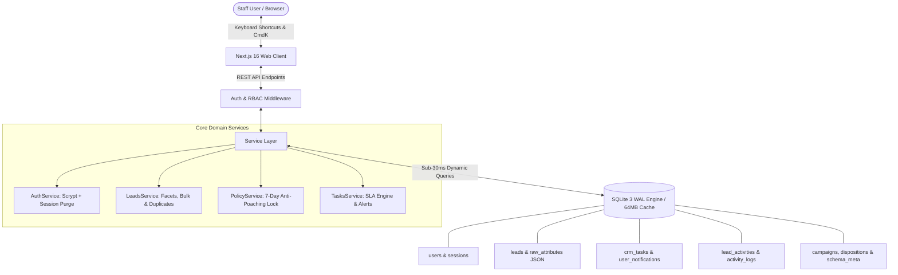

# 📚 DreamDesk CRM — Comprehensive Feature Guides & Operational Manuals

Welcome to the official documentation and operational handbook for **DreamDesk CRM**.  
This repository of guides covers all architectural foundations, enterprise features, governance policies, and operator workflows with real-world higher-education admissions use cases.

---

## 📑 Documentation Index

| # | Guide | Primary Focus | Audience |
|---|---|---|---|
| **01** | [**Lead Allocation & Distribution Engine**](./01_LEAD_ALLOCATION_AND_DISTRIBUTION.md) | Priority rules, round-robin auto-balancing, quota allocation & 1-click self-claim | Admins, Team Leads, Counselors |
| **02** | [**7-Day Counselor Ownership Policy & Anti-Poaching Governance**](./02_COUNSELOR_OWNERSHIP_POLICY.md) | Call locks, interaction protection, batch validation, overrides & audit trails | Admins, Team Leads |
| **03** | [**Prioritized Bulk Task Engine & Notification Center**](./03_TASK_ENGINE_AND_NOTIFICATIONS.md) | Task creation, dynamic SLAs (4h, 12h, 24h, 48h), live alerts & callback manager | All Staff |
| **04** | [**Smart Executive Journey & Multi-Density Timeline**](./04_EXECUTIVE_JOURNEY_AND_TIMELINE.md) | 4-card briefing strip, compact vs detailed views, date bucketing & quick notes | Counselors, Telecallers, TLs |
| **05** | [**Bulk Operations Suite**](./05_BULK_OPERATIONS_SUITE.md) | Multi-select dock, campaign switching, tag studio, stage updates & multi-page selection | Admins, Team Leads |
| **06** | [**Call Dispositions, Retry Cadence & Telecalling Framework**](./06_CALL_DISPOSITIONS_AND_CALLBACKS.md) | 2-Zone outcomes, unreachable retry cadence, cooldown policies, stage locks & sub-dispositions | Counselors, Telecallers, Team Leads |
| **07** | [**WhatsApp & Multi-Channel Communications**](./07_WHATSAPP_AND_COMMUNICATION_DRAWER.md) | Dynamic template interpolation, brochure dispatch, direct calling & chat logging | Counselors, Telecallers |
| **08** | [**Dynamic Schema Studio & Custom Attributes**](./08_SCHEMA_STUDIO_AND_CUSTOM_ATTRIBUTES.md) | Zero-migration JSON attributes, on-the-fly custom fields & faceted search filters | Super Admins |
| **09** | [**Data Import, Deduplication & Clean Ingestion**](./09_DATA_IMPORT_AND_DEDUPLICATION.md) | CSV/Excel batch imports, header auto-mapping, 10-digit phone normalization & safe merge | Admins, Operations |
| **10** | [**RBAC, Security, Geolocation & User Management**](./10_RBAC_SECURITY_AND_USER_MANAGEMENT.md) | 5-tier role hierarchy, instant deactivation, IP/geo audit logging & session security | Super Admins, Compliance |
| **11** | [**Executive Analytics Dashboard & Reporting**](./11_ANALYTICS_DASHBOARD_AND_REPORTING.md) | Workload comparison, campaign conversion ROI, funnel analysis & 1-click CSV reports | Leadership, Admins, TLs |
| **12** | [**Productivity Hotkeys & Operator Fast-Paths**](./12_KEYBOARD_SHORTCUTS_AND_FAST_PATHS.md) | Keyboard controls (<kbd>c</kbd>, <kbd>w</kbd>, <kbd>j</kbd>/<kbd>k</kbd>, <kbd>[</kbd>/<kbd>]</kbd>), CmdK command center & 100-call/day workflow | All Users |

---

## 🏛️ System Architecture Overview

DreamDesk CRM is architected for zero-latency higher-education operations. It runs on an embedded **SQLite Write-Ahead Logging (WAL)** engine with a 64MB memory cache, achieving sub-30ms facet compilation across 500,000+ student records.

---

## 👥 Role Matrix & Workspace Scopes

| Role | Leads Visibility | Management Capabilities | Allowed Tabs & Views |
|---|---|---|---|
| **Super Admin** | Institutional (All 500k+ Leads) | Full system access: Users, Schema, Policies, Deletions, Audit Logs | All Workspaces: Leads, Tasks, Pipeline, Dashboard, Campaigns, Dispositions, Schema Studio, Team, Import, Activity, Policies |
| **Team Lead** | Institutional (All 500k+ Leads) | Auto-Distribution, Quota Balancing, Campaigns, Dispositions, Policy Overrides | Leads, Tasks, Pipeline, Dashboard, Campaigns, Dispositions, Team, Import, Activity, Policies |
| **Senior Counselor** | Private Assigned Only | Follow-up Queues, Dispositions, Priority Callbacks, WhatsApp | Leads, Tasks, Pipeline |
| **Counselor** | Private Assigned Only | Consultation Logging, WhatsApp Drawer, Direct Dialing | Leads, Tasks, Pipeline |
| **Telecaller** | Private Assigned Only | Fast Call Dispositions, Callbacks, WhatsApp | Leads, Tasks, Pipeline |

---

## 💡 Quick Tips for New Operators

1. **Global Search & Command Bar**: Press <kbd>Ctrl</kbd> + <kbd>K</kbd> (or <kbd>⌘</kbd> + <kbd>K</kbd>) anywhere to jump between views, search students, or trigger bulk actions.
2. **Keyboard Calling**: Press <kbd>j</kbd> and <kbd>k</kbd> to step through student records, and hit <kbd>c</kbd> to call or <kbd>w</kbd> to open WhatsApp.
3. **Sequential Drawer Navigation**: Press <kbd>[</kbd> and <kbd>]</kbd> while viewing a student's profile drawer to move to previous and next students without closing the drawer.
4. **Instant Filter Toggle**: Press <kbd>f</kbd> to toggle the left faceted filter sidebar.
